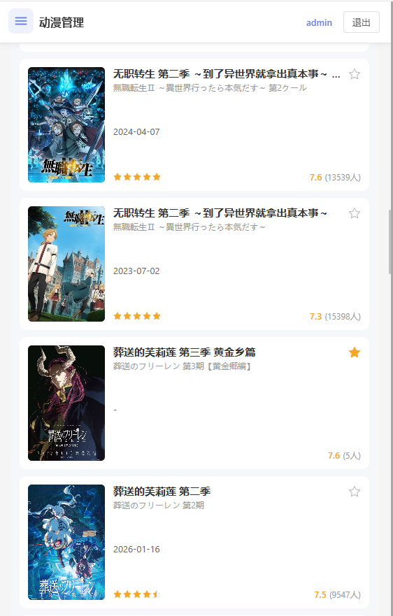
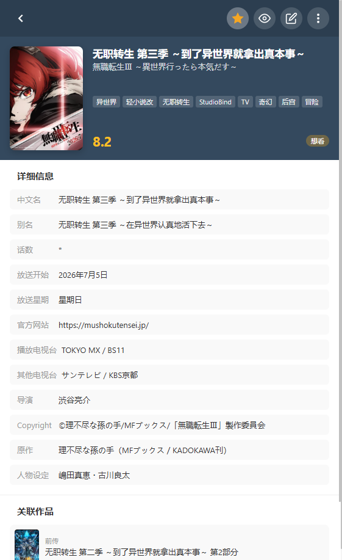

# 动漫管理模块

## 一、功能概述

动漫管理模块集成 Bangumi API，提供动漫搜索、收藏管理、状态跟踪、评分、关联作品和资源查找功能。


**移动端界面：**



*移动端动漫列表 - 卡片布局，评分显示*



*移动端动漫详情 - 全屏展示，详细信息*

## 二、数据库结构

### anime 表（动漫主表）

| 字段名 | 类型 | 说明 |
|--------|------|------|
| id | INTEGER | 主键，自增 |
| bangumi_id | INTEGER | Bangumi API 的条目 ID，唯一约束 |
| title | TEXT | 标题，必填 |
| name_cn | TEXT | 中文名称 |
| name_original | TEXT | 原始名称 |
| summary | TEXT | 简介/剧情概述 |
| cover_image | TEXT | 封面图片 URL |
| rating | REAL | Bangumi 评分（0-10） |
| rating_count | INTEGER | 评分人数，默认 0 |
| user_rating | INTEGER | 用户评分（0-10，0 表示未评分） |
| tags | TEXT | 标签，逗号分隔 |
| air_date | TEXT | 上映日期 |
| eps | INTEGER | 已播出集数，默认 0 |
| eps_total | INTEGER | 总集数，默认 0 |
| author | TEXT | 作者/原作 |
| director | TEXT | 导演/监督 |
| studio | TEXT | 动画制作公司 |
| infobox | TEXT | 详细信息（JSON 格式） |
| characters | TEXT | 角色信息（JSON 格式） |
| staff | TEXT | 制作人员（JSON 格式） |
| status | TEXT | 观看状态：'none' / 'want_to_watch' / 'watching' / 'watched'，默认 'none' |
| is_favorite | INTEGER | 是否收藏，默认 0 |
| created_at | DATETIME | 创建时间 |
| updated_at | DATETIME | 更新时间 |

---

## 三、后端 API 接口

**路由文件**: `backend/src/routes/anime.js`

### API 接口列表

| 方法 | 路由 | 功能 | 参数 |
|------|------|------|------|
| GET | `/anime/search` | 搜索 Bangumi 动漫 | `keyword`, `tag`, `page` |
| POST | `/anime/import` | 导入动漫到本地库 | `bangumiId`, `animeData` (二选一) |
| GET | `/anime/detail/:bangumiId` | 获取 Bangumi 详情 | 路径参数 `bangumiId` |
| GET | `/anime/bangumi/:bangumiId` | 从数据库获取详情（优先） | 路径参数 `bangumiId` |
| GET | `/anime/:id/cover` | 获取封面图片 | 路径参数 `id` |
| GET | `/anime/relations/:bangumiId` | 获取关联作品 | 路径参数 `bangumiId` |
| GET | `/anime` | 获取本地动漫列表 | `status`, `favorite`, `sortBy`, `sortOrder`, `page`, `pageSize` |
| GET | `/anime/:id` | 获取单个动漫详情 | 路径参数 `id` |
| PUT | `/anime/:id` | 更新动漫信息 | `status`, `isFavorite` |
| POST | `/anime/:id/favorite` | 切换收藏状态 | - |
| POST | `/anime/:id/status` | 更新观看状态 | `status` |
| POST | `/anime/:id/rating` | 更新用户评分 | `rating` (0-10) |
| DELETE | `/anime/:id` | 删除动漫 | - |
| GET | `/anime/resources/search` | 搜索 Nyaa 资源 | `keyword` |
| GET | `/anime/token-status` | 获取 Token 状态 | - |

### 接口详细说明

#### 1. 搜索动漫 `GET /anime/search`

**参数**:
- `keyword` - 搜索关键词（必填）

**返回**:
```json
{
  "data": [
    {
      "id": 515759,
      "name": "鬼滅の刃",
      "name_cn": "鬼灭之刃",
      "images": {
        "large": "https://...",
        "small": "https://..."
      },
      "rating": { "score": 8.5, "total": 5000 },
      "rating_count": 5000,
      "summary": "剧情简介...",
      "tags": ["热血", "战斗"],
      "air_date": "2019-04-06",
      "eps": 26,
      "eps_total": 26,
      "author": "吾峠呼世晴",
      "director": "外崎春雄",
      "studio": "ufotable",
      "infobox": [...]
    }
  ]
}
```

**特点**:
- 使用 Bangumi v0 API POST 请求
- 过滤只保留 type=2（动画类型）
- 模糊匹配评分排序（完全匹配 > 开头匹配 > 包含匹配 > 默认）
- 并行获取每个结果的详细信息

#### 2. 导入动漫 `POST /anime/import`

**参数**:
```json
{
  "bangumiId": 515759,  // 可选
  "animeData": {        // 可选，二选一
    "id": 515759,
    "name": "鬼滅の刃",
    "name_cn": "鬼灭之刃",
    "images": {...},
    "rating": {...},
    // ... 其他字段
  }
}
```

**返回**:
```json
{
  "id": 1,
  "message": "导入成功"
}
```

**特点**: 支持前端直接传递数据，避免重复 API 调用

#### 3. 获取列表 `GET /anime`

**参数**:
- `status` - 状态筛选（none/want_to_watch/watching/watched）
- `favorite` - 是否只看收藏（"true"）
- `sortBy` - 排序字段（updated_at/air_date/rating/user_rating/status）
- `sortOrder` - 排序方向（ASC/DESC）

**返回**:
```json
{
  "data": [...],
  "total": 100
}
```

#### 4. 资源搜索 `GET /anime/resources/search`

**参数**:
- `keyword` - 搜索关键词

**返回**: 磁力链接列表（标题、大小、种子数、下载数等）

**实现**: 爬取 Nyaa.si 网站

---

## 四、Bangumi API 集成

### API 配置

```javascript
const BANGUMI_API_BASE = process.env.BANGUMI_API_BASE || 'https://api.bgm.tv'
const BANGUMI_API_V0 = 'https://api.bgm.tv/v0'
```

### 代理配置

```javascript
const httpsAgent = process.env.HTTP_PROXY
  ? new HttpsProxyAgent(process.env.HTTP_PROXY)
  : undefined
```

### 请求头设置

```javascript
// Bangumi API 要求自定义 User-Agent
const BANGUMI_HEADERS = {
  'User-Agent': 'PersonalResourceManager/1.0 (https://github.com/user/pr-manager)'
}
```

### Bangumi API 调用

| 用途 | API 端点 | 方法 |
|------|---------|------|
| 搜索 | `/v0/search/subjects` | POST |
| 条目详情 | `/v0/subjects/{id}` | GET |
| 角色信息 | `/v0/subjects/{id}/characters` | GET |
| 制作人员 | `/v0/subjects/{id}/persons` | GET |
| 关联作品 | `/v0/subjects/{id}/subjects` | GET |

### 并行请求优化

```javascript
// 获取动漫详情时并行请求三个 API
const [subjectRes, charactersRes, personsRes] = await Promise.all([
  axios.get(`${BANGUMI_API_V0}/subjects/${bangumiId}`, {
    httpsAgent,
    timeout: 15000,
    headers: BANGUMI_HEADERS
  }),
  axios.get(`${BANGUMI_API_V0}/subjects/${bangumiId}/characters`, {
    httpsAgent,
    timeout: 15000,
    headers: BANGUMI_HEADERS
  }),
  axios.get(`${BANGUMI_API_V0}/subjects/${bangumiId}/persons`, {
    httpsAgent,
    timeout: 15000,
    headers: BANGUMI_HEADERS
  })
])
```

### infobox 信息提取

从 Bangumi 的 infobox 结构中提取：
- 作者/原作（`作者`, `原作`）
- 导演/监督（`导演`, `监督`）
- 制作公司（`动画制作`, `制作`）

```javascript
function extractFromInfobox(infobox, key) {
  if (!infobox || !Array.isArray(infobox)) return null
  const item = infobox.find(i => i.key === key)
  if (!item) return null
  if (Array.isArray(item.value)) {
    return item.value.map(v => typeof v === 'string' ? v : v.v || v.name).join(', ')
  }
  return typeof item.value === 'string' ? item.value : item.value.v || item.value.name
}
```

---

## 五、前端页面功能

### 主视图 `frontend/src/views/Anime.vue`

#### 功能模块

**1. Bangumi 搜索**
- 输入框 + 搜索按钮
- 回车触发搜索
- 搜索结果以卡片网格展示

**2. 搜索结果卡片**
- 封面图片 + 评分徽章
- 标题（中文/原名）
- 元信息（上映日期、集数）
- 制作信息（作者、监督、制作公司）
- 标签显示（最多 4 个）
- 操作按钮：
  - 添加到收藏（已添加显示灰色禁用）
  - 查看详情

**3. 我的动漫库**
- 筛选器：
  - 状态筛选（全部/未标记/想看/在看/看过）
  - 只看收藏
- 排序：更新时间/上映日期/总评分/我的评分/标记状态
- 升序/降序切换
- 表格展示：封面、标题、评分、我的评分、状态、收藏、操作

**4. 状态管理**
- 下拉切换状态：未标记 / 想看 / 在看 / 看过
- 鼠标悬停显示下拉菜单

**5. 评分功能**
- 5 星评分组件（支持半星）
- 后端存储 0-10，前端显示 0-5 星

**6. 收藏功能**
- 点击心形图标切换收藏状态
- 心形图标可点击

**7. 操作列**
- 详情按钮（三横线图标）
- 隐藏按钮（眼睛图标）：隐藏当前动漫，不再显示在列表中
- 删除按钮（带确认）

### 详情对话框 `frontend/src/components/AnimeDetailDialog.vue`


#### 展示内容

- **封面图片 + 评分框**
  - 评分显示（X.X 分）
  - 评分人数

- **基本信息**
  - 标题、原名
  - 上映日期
  - 集数
  - 作者、监督、制作公司

- **标签列表**
  - 最多显示 15 个标签

- **简介**
  - 剧情概述

- **详细信息（infobox）**
  - 别名、话数、放送星期等
  - 支持多值显示

- **角色·声优**
  - 角色头像 + 姓名 + 角色定位
  - 声优头像 + 姓名

- **制作人员**
  - 头像 + 姓名 + 职位

- **关联作品**
  - 只显示前传、续集
  - 可点击跳转到新详情

- **资源搜索结果**
  - 磁力链接列表
  - 显示大小、种子数、下载数

#### 交互功能

- **查找资源**：搜索 Nyaa 磁力链接
- **状态切换**：下拉框切换状态
- **收藏/取消收藏**：按钮切换
- **删除**：带确认的删除按钮
- **添加到收藏**：未添加时显示
- **已添加**：已添加时显示灰色禁用按钮
- **复制磁力**：一键复制磁力链接
- **点击关联作品**：跳转到新详情页

---

## 六、前端架构

### PC/移动端分离架构

采用条件渲染方式实现响应式适配：

**主入口文件** (`frontend/src/views/Anime.vue`):
```vue
<template>
  <AnimeMobile v-if="isMobile" />
  <div v-else class="anime">
    <!-- PC端内容 -->
  </div>
</template>
```

**PC端组件** (`frontend/src/pc/pages/AnimePC.vue`):
- 表格布局展示动漫列表
- 支持表头排序
- 搜索和筛选功能
- 分页浏览

**移动端组件** (`frontend/src/mobile/pages/AnimeMobile.vue`):
- 卡片列表布局
- 支持滑动删除
- 底部操作栏
- 响应式搜索栏

**移动端详情页** (`frontend/src/mobile/pages/AnimeDetailMobile.vue`):
- 全屏展示动漫详情
- 关联作品点击跳转
- 资源搜索结果显示

---

## 七、性能优化

### 1. 封面加载优化

#### 问题
- 列表加载时返回所有封面数据，响应体积大
- 封面加载慢，影响用户体验

#### 解决方案
**IndexedDB 缓存 + IntersectionObserver 懒加载**

#### 实现细节

**后端优化**：
```javascript
// 列表接口不返回封面数据
router.get('/', authenticateToken, async (req, res) => {
  const parsedRows = rows.map(row => ({
    ...row,
    cover_image_data: undefined  // 不返回封面数据
  }))
})

// 新增封面接口（按需获取）
router.get('/:id/cover', authenticateToken, async (req, res) => {
  const row = db.prepare('SELECT cover_image_data, cover_image FROM anime WHERE id = ?').get(id)
  res.json({
    cover: row.cover_image_data || null,
    coverUrl: row.cover_image || null
  })
})
```

**前端缓存工具** (`frontend/src/utils/animeCoverCache.js`)：
```javascript
// IndexedDB 存储
const DB_NAME = 'AnimeCoverCache'
const STORE_NAME = 'covers'

// 初始化数据库
export async function initAnimeCoverDB()

// 获取缓存
export async function getAnimeCoverFromCache(animeId)

// 保存缓存
export async function saveAnimeCoverToCache(animeId, coverData)
```

**懒加载实现**：
```javascript
// IntersectionObserver 监听
const coverObserver = new IntersectionObserver((entries) => {
  entries.forEach(entry => {
    if (entry.isIntersecting) {
      const animeData = entry.target.__anime__
      if (animeData) loadCover(animeData.id)
      coverObserver.unobserve(entry.target)
    }
  })
}, { rootMargin: '50px' })  // 提前50px预加载

// 加载封面
async function loadCover(id) {
  // 1. 先从 IndexedDB 缓存读取
  const cached = await getAnimeCoverFromCache(id)
  if (cached) {
    coverCache.value[id] = cached
    return
  }

  // 2. 缓存未命中，从服务器获取
  const response = await api.anime.getCover(id)
  const cover = response.data.cover || response.data.coverUrl
  if (cover) {
    coverCache.value[id] = cover
    // 保存到 IndexedDB（只缓存 base64 数据）
    if (response.data.cover) {
      await saveAnimeCoverToCache(id, cover)
    }
  }
}
```

#### 效果
- 首屏加载快：列表响应体积减少 80%+
- 滚动流畅：只加载可见区域的封面
- 持久缓存：刷新页面不重复请求

---

### 2. 详情页加载优化

#### 问题
- 每次打开详情页都调用 Bangumi API（2-3秒）
- 数据库已保存详情信息，但未利用

#### 解决方案
**优先从数据库获取，未命中才调用 API**

#### 新增接口

**后端接口** (`backend/src/routes/anime.js`)：
```javascript
// 从数据库获取动漫详情（通过 bangumi_id）
router.get('/bangumi/:bangumiId', authenticateToken, async (req, res) => {
  const db = getDatabase()
  const row = db.prepare('SELECT * FROM anime WHERE bangumi_id = ?').get(req.params.bangumiId)

  if (!row) {
    return res.status(404).json({ message: '动漫不存在' })
  }

  // 解析 JSON 字段（characters, staff, infobox）
  const result = {
    ...row,
    tags: row.tags ? row.tags.split(',') : [],
    infobox: row.infobox ? JSON.parse(row.infobox) : null,
    characters: row.characters ? JSON.parse(row.characters) : [],
    staff: row.staff ? JSON.parse(row.staff) : []
  }

  res.json({ data: result })
})
```

**前端 API** (`frontend/src/api/index.js`)：
```javascript
getByBangumiId: (bangumiId) => api.get(`/anime/bangumi/${bangumiId}`)
```

#### 加载逻辑优化

**前端详情组件** (`frontend/src/components/AnimeDetailDialog.vue`)：
```javascript
async function loadDetail() {
  // 1. 如果传入的是本地数据（有 id 字段），直接使用
  if (props.animeData?.id) {
    anime.value = props.animeData
    characters.value = props.animeData.characters || []
    staff.value = props.animeData.staff || []
    return
  }

  // 2. 如果有 bangumiId，优先从数据库获取
  if (props.bangumiId) {
    try {
      const dbRes = await api.anime.getByBangumiId(props.bangumiId)
      if (dbRes.data.data) {
        anime.value = dbRes.data.data
        characters.value = dbRes.data.data.characters || []
        staff.value = dbRes.data.data.staff || []
        return
      }
    } catch {
      // 数据库中没有，继续从 API 获取
    }
  }

  // 3. 数据库没有，从 Bangumi API 获取
  const res = await api.anime.getDetail(props.bangumiId)
  anime.value = res.data.data.subject
  characters.value = res.data.data.characters || []
  staff.value = res.data.data.persons || []
}
```

#### 效果对比

| 场景 | 优化前 | 优化后 |
|------|--------|--------|
| 本地列表点击详情 | 调用 API 检查（2-3s） | 直接使用数据（<100ms） |
| 搜索结果点击详情（已入库） | 调用 Bangumi API（2-3s） | 查询数据库（~100ms） |
| 搜索结果点击详情（未入库） | 调用 Bangumi API（2-3s） | 调用 Bangumi API（2-3s） |

---

### 3. 搜索分页优化

#### 问题
- Bangumi API 每次最多返回 20 条结果
- 用户需要手动请求下一页

#### 解决方案
**按需分页（点击下一页再请求）**

#### 实现
```javascript
// 前端搜索
async function handleSearch(page = 1) {
  const response = await api.anime.search(searchKeyword.value, searchTag.value, page)
  searchResults.value = response.data.data || []
  searchPagination.value.total = Math.min(response.data.total || 0, 100)  // 最多100条
  searchPagination.value.current = page
}

// 后端搜索
router.get('/search', authenticateToken, async (req, res) => {
  const { keyword, tag, page = 1 } = req.query
  const offset = (parseInt(page) - 1) * 20

  const response = await axios.post(`${BANGUMI_API_V0}/search/subjects`, {
    keyword,
    tag,
    type: 2,  // 动画类型
    limit: 20,
    offset
  })
})
```

---

## 八、技术实现细节

### 1. 表头排序功能

#### 问题
- 表头点击排序无反应
- 取消排序功能不生效
- 下拉栏排序与表头排序不同步

#### 解决方案
**双向同步 + 取消排序恢复默认**

#### 实现细节

**下拉栏与表头同步**：
```javascript
// 字段映射：列 colKey -> 后端字段名
const sortFieldMap = {
  'year': 'air_date',
  'rating': 'rating',
  'userRating': 'user_rating',
  'status': 'status'
}

// 反向映射：后端字段名 -> 列 colKey
const sortColKeyMap = {
  'air_date': 'year',
  'rating': 'rating',
  'user_rating': 'userRating',
  'status': 'status'
}

// 计算表格排序状态（双向同步）
const tableSort = computed(() => {
  const colKey = sortColKeyMap[sortBy.value]
  if (!colKey) {
    // 下拉栏选择的是表头没有的字段（如 updated_at），清空表头高亮
    return null
  }
  return {
    sortBy: colKey,
    descending: sortOrder.value === 'DESC'
  }
})
```

**处理取消排序**：
```javascript
function handleSortChange(context) {
  const sort = context?.sort || context

  if (!sort || !sort.sortBy) {
    // 取消排序时，恢复默认排序（更新时间降序）
    sortBy.value = 'updated_at'
    sortOrder.value = 'DESC'
    pagination.value.current = 1
    loadAnime()
    return
  }

  // 正常排序处理
  const field = sortFieldMap[sort.sortBy] || sort.sortBy
  sortBy.value = field
  sortOrder.value = sort.descending ? 'DESC' : 'ASC'
  pagination.value.current = 1
  loadAnime()
}
```

#### 效果
- ✅ 表头点击排序生效
- ✅ 再次点击取消排序，恢复默认
- ✅ 下拉栏选择同步表头高亮
- ✅ 下拉栏选择"更新时间"，表头无高亮

---

### 2. 代理配置

```javascript
// 通过环境变量配置代理
const httpsAgent = process.env.HTTP_PROXY
  ? new HttpsProxyAgent(process.env.HTTP_PROXY)
  : undefined

// 所有 Bangumi API 请求使用代理
axios.get(url, {
  httpsAgent,
  timeout: 15000,
  headers: BANGUMI_HEADERS
})
```

### 3. API 调用优化

```javascript
// 并行请求
const [subjectRes, charactersRes, personsRes] = await Promise.all([...])

// 数据传递
// 前端可将搜索结果直接传给后端导入
await api.anime.import(null, {
  id: anime.id,
  name: anime.name,
  name_cn: anime.name_cn,
  // ... 完整数据
})

// 超时控制
axios.get(url, { timeout: 15000 })
```

### 3. 关联作品处理

```javascript
// 后端过滤：只保留前传、续集
const relations = (response.data || []).filter(item => {
  const relationType = item.relation || ''
  return relationType.includes('前传') || 
         relationType.includes('续集') || 
         relationType.includes('前作') || 
         relationType.includes('续作') ||
         relationType.includes('Prequel') ||
         relationType.includes('Sequel')
})

// 前端跳转
function openRelationDetail(rel) {
  emit('openRelation', {
    bangumiId: rel.id,
    animeData: {
      bangumi_id: rel.id,
      name: rel.name,
      name_cn: rel.name_cn,
      cover_image: rel.images?.large,
      // ...
    }
  })
  visible.value = false  // 关闭当前详情
}
```

### 4. 多源资源搜索

**支持的资源源（按优先级）**：
1. **Nyaa**（日本）- 主要资源源
2. **动漫花园**（DMHY）- 备选源
3. **ACG.RIP** - 备选源
4. **蜜柑计划** - 备选源

**搜索模式**：
- **并行模式**（默认）：同时搜索所有源，合并结果并去重
- **顺序模式**：按优先级依次搜索，第一个源有结果就停止

**实现原理**：
```javascript
// 资源源优先级配置
const sourcePriority = [
  { name: 'Nyaa', search: searchNyaa },
  { name: '动漫花园', search: searchDMHY },
  { name: 'ACG.RIP', search: searchACGRip },
  { name: '蜜柑计划', search: searchMikan }
]

// 顺序匹配模式
if (mode === 'sequential') {
  for (const source of sourcePriority) {
    const results = await source.search(keyword)
    if (results.length > 0) {
      allResults = results
      break // 第一个源有结果就停止
    }
  }
}

// 并行搜索模式（默认）
const searchPromises = sourcePriority.map(source => source.search(keyword))
const results = await Promise.all(searchPromises)
allResults = results.flat()
```

**优化策略**：
- 自动去重（根据标题前50字符）
- 智能排序（Nyaa结果优先 + 种子数降序）
- 错误容错（单个源失败不影响整体）
- 最多返回 50 条结果

**Nyaa 搜索实现示例**：
```javascript
// 使用 cheerio 解析 HTML
const $ = cheerio.load(response.data)
const results = []

$('tr.default, tr.success, tr.danger').each((index, element) => {
  const $el = $(element)
  const titleLink = $el.find('td:nth-child(2) a:last-child')
  const title = titleLink.attr('title') || titleLink.text().trim()
  const magnetLink = $el.find('a[href^="magnet:"]').attr('href')
  
  results.push({
    title,
    magnetLink,
    size: $el.find('td:nth-child(4)').text().trim(),
    seeders: $el.find('td:nth-child(6)').text().trim(),
    leechers: $el.find('td:nth-child(7)').text().trim(),
    downloads: $el.find('td:nth-child(8)').text().trim(),
    source: 'Nyaa'
  })
})
```

### 5. 前端数据处理

```javascript
// HTTP 转 HTTPS 处理图片链接
function toHttps(url) {
  if (!url) return url
  return url.replace(/^http:\/\//, 'https://')
}

// 图片加载失败显示默认占位图
function handleImageError(e) {
  e.target.src = 'data:image/svg+xml;base64,...'
}

// JSON 字段解析
if (typeof animeData.characters === 'string') {
  characters.value = JSON.parse(animeData.characters)
} else {
  characters.value = animeData.characters || []
}

// 兼容 Bangumi API 格式和本地数据库格式
function getRatingScore() {
  if (typeof anime.value.rating === 'number') {
    return anime.value.rating  // 本地数据库
  }
  if (anime.value.rating?.score) {
    return anime.value.rating.score  // Bangumi API
  }
  return 0
}
```

### 6. 认证机制

```javascript
// 所有 API 需要 JWT 认证
router.get('/anime', authenticateToken, async (req, res) => {...})

// 请求拦截器自动添加 Authorization 头
api.interceptors.request.use((config) => {
  const token = localStorage.getItem('token')
  if (token) {
    config.headers.Authorization = `Bearer ${token}`
  }
  return config
})

// 401 响应自动跳转登录页
api.interceptors.response.use(
  (response) => response,
  (error) => {
    if (error.response?.status === 401) {
      localStorage.removeItem('token')
      window.location.href = '/login'
    }
    return Promise.reject(error)
  }
)
```

---

## 八、前端 API 封装

**文件**: `frontend/src/api/index.js`

```javascript
anime: {
  search: (keyword, tag, page = 1) => api.get('/anime/search', { params: { keyword, tag, page } }),
  import: (bangumiId, animeData) => api.post('/anime/import', { bangumiId, animeData }),
  list: (params) => api.get('/anime', { params }),
  get: (id) => api.get(`/anime/${id}`),
  getByBangumiId: (bangumiId) => api.get(`/anime/bangumi/${bangumiId}`),
  getCover: (id) => api.get(`/anime/${id}/cover`),
  getDetail: (bangumiId) => api.get(`/anime/detail/${bangumiId}`),
  getRelations: (bangumiId) => api.get(`/anime/relations/${bangumiId}`),
  update: (id, data) => api.put(`/anime/${id}`, data),
  delete: (id) => api.delete(`/anime/${id}`),
  toggleFavorite: (id) => api.post(`/anime/${id}/favorite`),
  updateStatus: (id, status) => api.post(`/anime/${id}/status`, { status }),
  updateRating: (id, rating) => api.post(`/anime/${id}/rating`, { rating }),
  searchResources: (keyword) => api.get('/anime/resources/search', { params: { keyword } }),
  batchDownloadCovers: () => api.post('/anime/batch-download-covers'),
  getTokenStatus: () => api.get('/anime/token-status')
}
```

---

## 九、关键文件路径

| 功能模块 | 文件路径 |
|----------|----------|
| 后端路由 | `backend/src/routes/anime.js` |
| 数据库配置 | `backend/src/config/database.js` |
| 前端视图 | `frontend/src/views/Anime.vue` |
| PC端组件 | `frontend/src/pc/pages/AnimePC.vue` |
| 移动端组件 | `frontend/src/mobile/pages/AnimeMobile.vue` |
| 移动端详情 | `frontend/src/mobile/pages/AnimeDetailMobile.vue` |
| 详情组件 | `frontend/src/components/AnimeDetailDialog.vue` |
| API 定义 | `frontend/src/api/index.js` |

---

## 十、配置说明

### 环境变量

| 变量名 | 说明 | 默认值 |
|--------|------|--------|
| `HTTP_PROXY` | HTTP 代理地址 | `http://clash:7890` |
| `BANGUMI_API_BASE` | Bangumi API 基础 URL | `https://api.bgm.tv` |

### Clash 代理配置

```yaml
# docker-compose.clash.yml
services:
  clash:
    image: dreamacro/clash
    environment:
      - HTTP_PROXY=http://clash:7890
    networks:
      - pr-network
```

---

## 十一、使用说明

### 1. 搜索动漫

1. 在搜索框输入关键词
2. 点击搜索按钮或回车
3. 搜索结果以卡片形式展示
4. 可点击"详情"查看更多信息

### 2. 添加到收藏

- 搜索结果：点击"添加"按钮
- 详情页：点击"添加到收藏"按钮
- 已添加的显示灰色"已添加"按钮

### 3. 管理动漫库

- **状态切换**：鼠标悬停状态列，选择状态
- **收藏切换**：点击心形图标
- **评分**：点击星星评分（支持半星）
- **删除**：点击删除按钮，确认删除

### 4. 筛选排序

- 状态筛选：全部/未标记/想看/在看/看过
- 只看收藏：勾选复选框
- 排序：选择排序字段 + 升降序

### 5. 查看详情

- 搜索结果：点击详情按钮
- 动漫库：点击详情按钮

### 6. 查找资源

1. 在详情页点击"查找资源"
2. 自动搜索磁力链接
3. 点击"复制磁力"复制链接

### 7. 关联作品

- 详情页显示前传、续集
- 点击可跳转到关联作品详情

---

## 十二、注意事项

1. **Bangumi API 限制**：
   - 需要自定义 User-Agent
   - 搜索不够模糊，建议使用完整名称
   - 某些条目可能没有关联作品

2. **代理配置**：
   - 需要配置 HTTP_PROXY 才能访问 Bangumi API
   - Clash 代理需先部署

3. **数据一致性**：
   - 导入后修改不影响 Bangumi 原始数据
   - 评分范围 0-10（0 表示未评分）

4. **图片处理**：
   - 自动将 HTTP 图片链接转为 HTTPS
   - 加载失败显示默认占位图

5. **资源搜索**：
   - 使用 Nyaa.si 网站
   - 需要网络访问
   - 结果最多 20 条

6. **悬停提示**：
   - 表格标题列使用浏览器原生 title 属性
   - 搜索结果卡片使用原生 title 属性
   - 避免重复悬停框和样式冲突�