# 我如何从零搭建一个全功能个人资源管理系统

## 前言

作为一个程序员，我一直在寻找一个能统一管理自己所有数字资源的方法。文档、音乐、电子书、代码仓库、书签、动漫收藏...这些资源分散在各个平台，管理起来非常混乱。市面上虽然有很多现成的方案，但都不完全符合我的需求。

于是，我决定自己动手，从零开始搭建一个**个人资源管理系统**。这篇文章记录了整个开发过程中的技术选型、功能实现、踩坑经历和解决方案。

---

## 一、项目概览

### 功能模块

这个系统包含 **8大核心模块**：

| 模块 | 功能 | 数据库表 |
|------|------|----------|
| 📄 文档管理 | 分类、标签、版本控制、PDF预览、隐私空间 | documents, categories, document_versions |
| 📝 博客管理 | Markdown编辑器、分类标签、草稿发布 | blog_posts, blog_categories, blog_tags |
| 🎵 音乐管理 | FFprobe元数据解析、播放列表、封面提取、**歌词同步**、**均衡器** | music, playlists, playlist_songs |
| 📚 书籍管理 | 电子书上传、在线阅读器、进度记忆、在线资源搜索 | books, book_categories, reading_progress |
| 💻 代码管理 | Git仓库链接管理、README预览 | code_repositories |
| 🔖 书签管理 | URL收藏、图标自动获取 | bookmarks |
| 🎬 动漫管理 | Bangumi爬虫、收藏标记、评分系统、**多源资源搜索** | anime |
| 🎮 游戏管理 | Steam集成、成就追踪 | games, game_achievements |

### 界面预览


*仪表盘首页 - 显示系统概览和各模块入口*

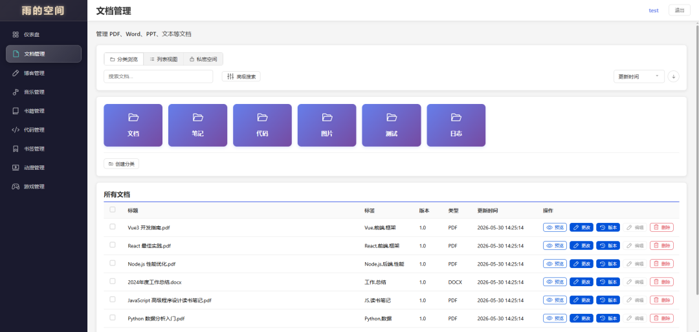
*文档管理 - 支持分类、标签、PDF预览*

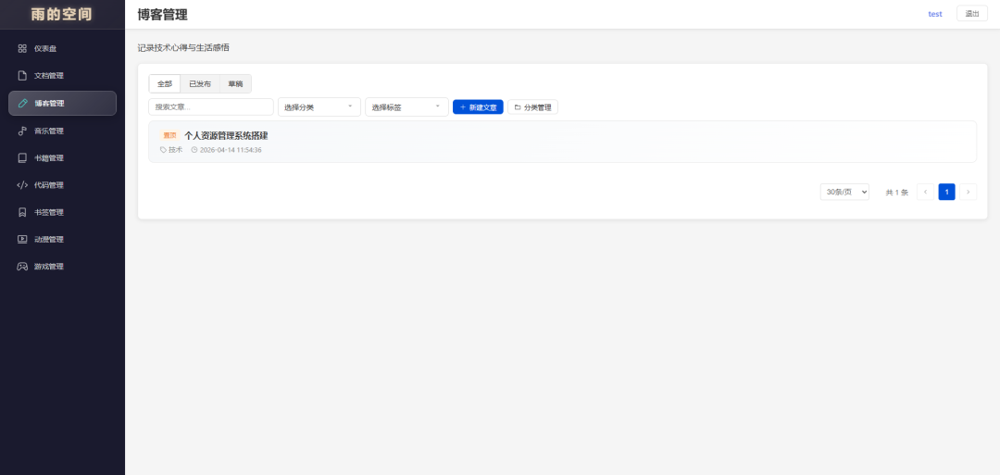
*博客管理 - Markdown编辑器，支持草稿/发布*

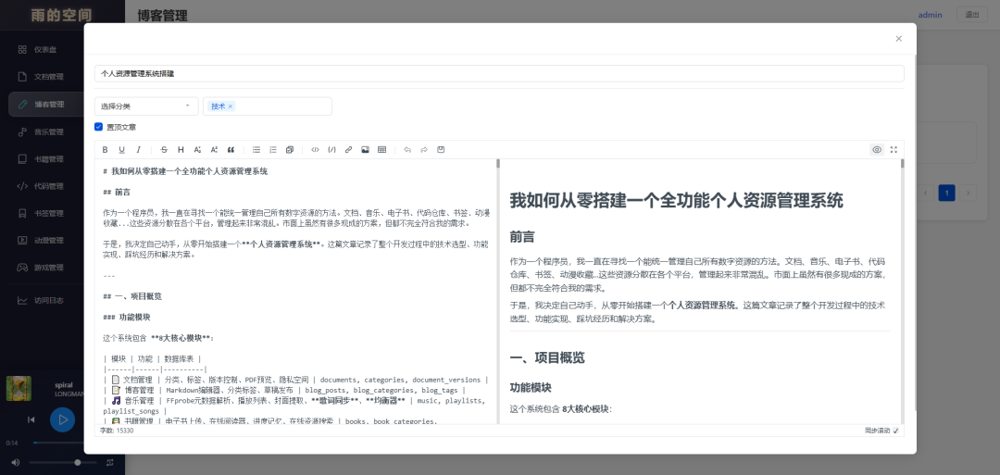
*博客编辑器 - 分屏预览，代码高亮*

### 技术栈

**前端**
- Vue 3.4 + Vite 5.0
- **原生 CSS + 自定义组件（UI框架完全自研）**
- Pinia（状态管理）
- Vue Router 4
- Axios（HTTP请求）
- marked + highlight.js（Markdown渲染）
- md-editor-v3（Markdown编辑器）
- mammoth（Word文档解析）
- xlsx（Excel解析）
- PDF.js（PDF预览）

**后端**
- Node.js + Express 4.18
- better-sqlite3（SQLite同步API）
- JWT + bcryptjs（用户认证）
- Multer（文件上传）
- Cheerio（HTML解析）
- https-proxy-agent（代理请求）
- **Redis（缓存）**
- **express-rate-limit + helmet（安全加固）**

**部署**
- Docker Compose
- NAS服务器
- Clash代理（解决爬虫被墙问题）

---

## 二、各模块功能详解

### 📄 文档管理模块

**核心功能**：
- **多级分类系统**：支持无限级分类（如：技术/前端/Vue），分类支持拖拽排序
- **标签管理**：每篇文档可添加多个标签，支持标签筛选
- **文件上传**：支持拖拽上传、批量上传
- **在线预览**：
  - 文本文件：Markdown、代码文件直接渲染
  - PDF：使用 PDF.js 实现缩放、翻页
  - Word/Excel：前端解析，无需后端转换
- **版本控制**：自动保存历史版本，支持版本回退
- **全文搜索**：按标题、内容、标签搜索
- **🔒 隐私空间**：独立加密存储区域，用于存放私密文档

---

### 📝 博客管理模块

**核心功能**：
- **Markdown编辑器**：使用 md-editor-v3，支持实时预览、工具栏、快捷键
- **文章管理**：草稿/发布状态、置顶、创建时间/更新时间
- **分类和标签**：独立的分类树和标签系统，支持颜色自定义
- **只读预览**：点击文章卡片进入预览视图，点击编辑按钮才进入编辑
- **代码高亮**：Atom 主题，黑底 + 语法高亮

---

### 🎵 音乐管理模块

**核心功能**：
- **元数据解析**：使用 FFprobe（FFmpeg）解析音频文件的标题、艺术家、专辑、时长
- **封面提取**：自动提取嵌入的封面图片，支持 MP3/FLAC/M4A 等格式
- **播放列表**：创建、编辑、删除歌单，拖拽排序歌曲
- **在线播放**：全局播放器，支持单曲循环、随机播放、顺序播放
- **搜索筛选**：按艺术家、专辑、歌单筛选
- **📤 大文件上传**：支持超大音乐文件（支持 100MB+）、断点续传
- **🎶 歌词功能**（新增）：多源歌词搜索、批量下载、双语歌词、全屏歌词窗口
- **🎛️ 均衡器功能**（新增）：10段均衡器、预设方案、实时调节

**歌词功能实现**：

采用多源聚合策略，按优先级顺序尝试：

```javascript
const LYRIC_SOURCES = [
  {
    name: '网易云音乐',
    search: searchNeteaseMusic,
    getLyric: getNeteaseLyric
  },
  {
    name: 'QQ音乐',
    search: searchQQMusic,
    getLyric: getQQMusicLyric
  },
  {
    name: '酷狗音乐',
    search: searchKugouMusic,
    getLyric: getKugouLyric
  }
]
```

**双语歌词合并算法**：

```javascript
function mergeLrcWithTranslation(originalLrc, translationLrc) {
  // 1. 解析歌词为时间戳映射
  const originalMap = parseLrcToMap(originalLrc)
  const translationMap = parseLrcToMap(translationLrc)
  
  // 2. 合并原文和翻译
  const result = []
  for (const [timestamp, text] of originalMap) {
    result.push(`[${timestamp}]${text}`)
    if (translationMap.has(timestamp)) {
      result.push(`[${timestamp}]${translationMap.get(timestamp)}`)
    }
  }
  
  return result.join('\n')
}
```

**均衡器实现**：

使用 Web Audio API 的 BiquadFilterNode：

```javascript
class Equalizer {
  constructor() {
    this.audioContext = null
    this.bands = [0, 0, 0, 0, 0, 0, 0, 0, 0, 0] // 10段均衡器
    this.filters = []
    this.frequencies = [31, 62, 125, 250, 500, 1000, 2000, 4000, 8000, 16000]
  }
  
  // 创建滤波器
  createFilters(source, destination) {
    this.filters = this.frequencies.map((freq, i) => {
      const filter = this.audioContext.createBiquadFilter()
      filter.type = 'peaking'
      filter.frequency.value = freq
      filter.Q.value = 1.4
      filter.gain.value = this.bands[i]
      return filter
    })
    
    // 串联滤波器
    let lastNode = source
    this.filters.forEach(filter => {
      lastNode.connect(filter)
      lastNode = filter
    })
    lastNode.connect(destination)
  }
}
```

**预设方案**：

| 预设 | 说明 | 参数 |
|------|------|------|
| 默认 | 平衡的频率响应 | 全部 0dB |
| 低音增强 | 强化低频效果 | 低频 +6dB |
| 人声增强 | 提升中频人声 | 中频 +4dB |
| 高音增强 | 提升高频细节 | 高频 +5dB |
| 摇滚 | 强调节奏感 | 低频+高频 +4dB |
| 古典 | 平衡的动态范围 | 轻微V型曲线 |

**音乐管理界面**：

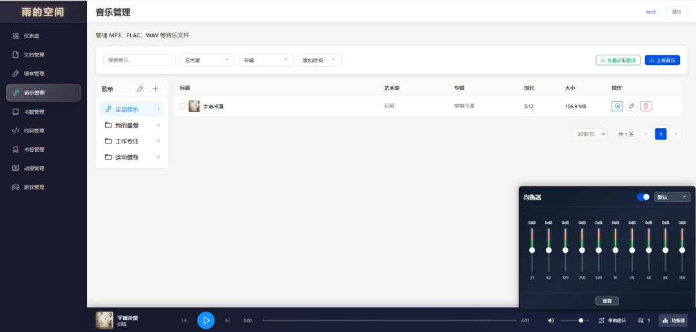
*音乐管理 - 表格布局，支持筛选和排序*

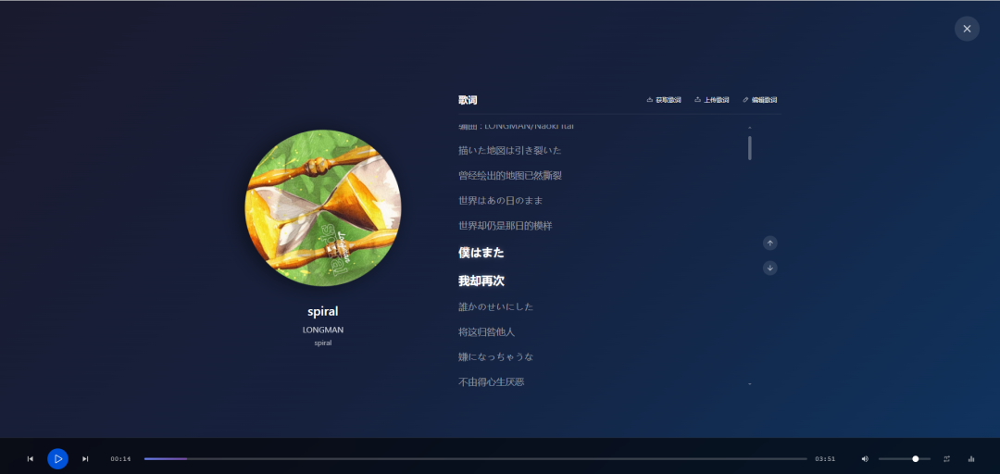
*歌词全屏窗口 - 网易云风格，同步高亮*

---

### 📚 书籍管理模块

**核心功能**：
- **电子书上传**：支持 EPUB、PDF、TXT 等格式
- **在线阅读器**：
  - EPUB：章节目录、翻页、字体调整
  - PDF：缩放、翻页
  - TXT：自动分章、编码检测
- **阅读进度**：自动保存当前位置，下次打开恢复（支持多用户隔离）
- **书籍分类**：分类树管理，支持子分类
- **🔍 在线资源搜索**：爬取 Anna's Archive 和 Nyaa 搜索电子书

**界面预览**：

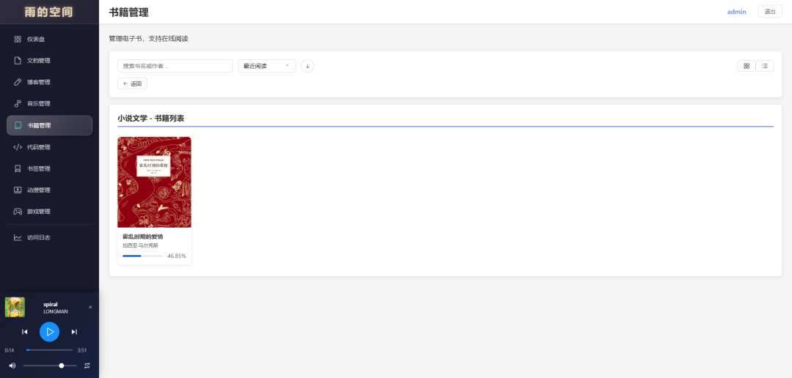
*书籍管理 - 封面/列表双视图，支持分类筛选*

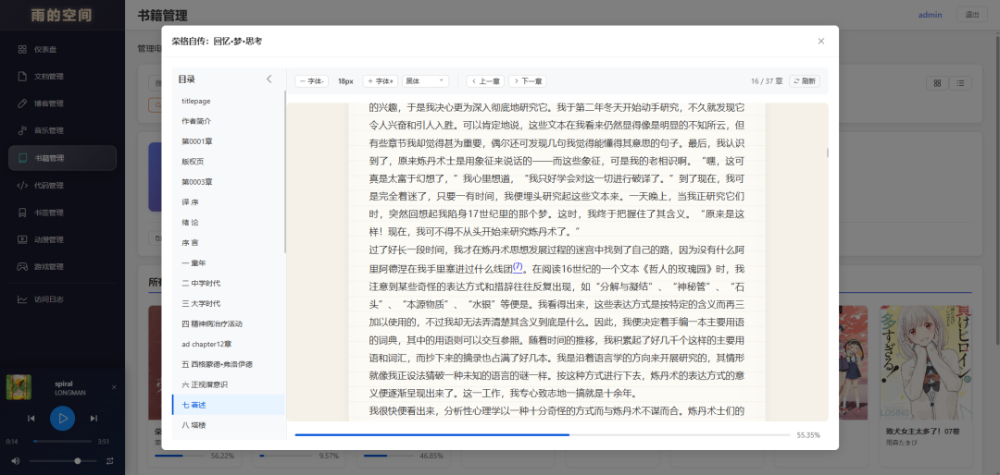
*书籍阅读器 - 目录导航，字体调节，进度保存*

---

### 💻 代码管理模块

**核心功能**：
- **仓库管理**：添加 Git 仓库链接（GitHub、GitLab 等）
- **一键克隆**：自动克隆仓库到服务器
- **文件浏览**：在线浏览仓库文件结构
- **提交历史**：查看最近的提交记录
- **README预览**：渲染 README.md，支持图片转 base64

**界面预览**：

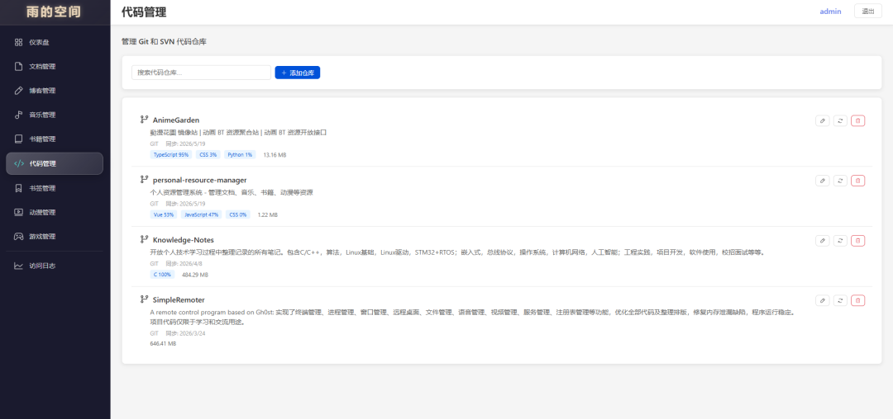
*代码管理 - 仓库卡片，GitHub信息自动获取*

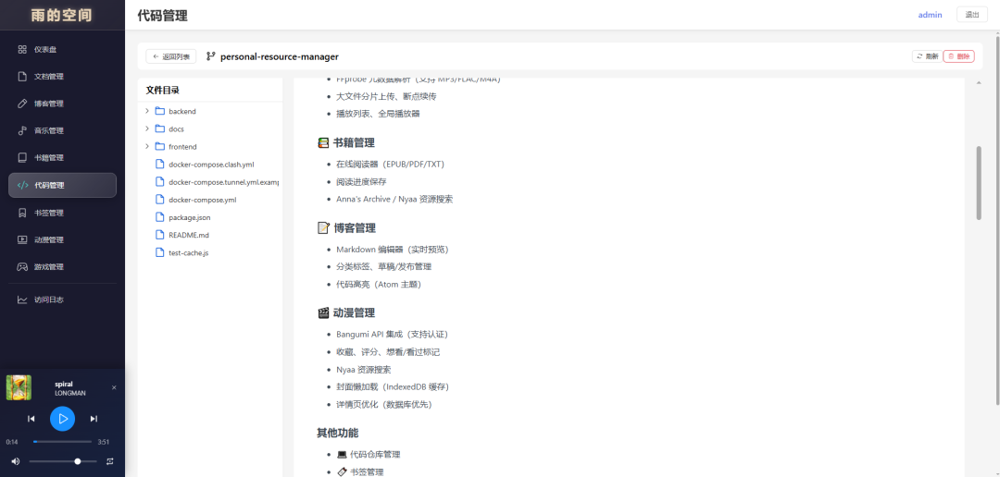
*代码详情 - 文件树 + 代码预览，支持语法高亮*

---

### 🔖 书签管理模块

**核心功能**：
- **URL 收藏**：快速保存网页链接
- **图标获取**：自动获取网站 favicon
- **分类管理**：按类别整理书签
- **搜索**：按标题、URL、标签搜索

**界面预览**：

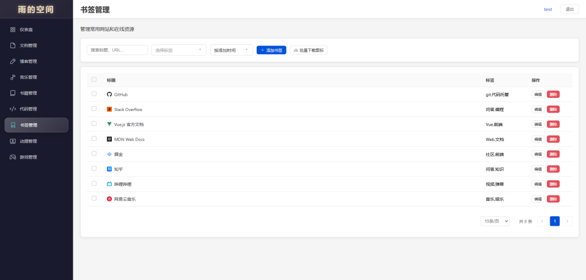
*书签管理 - URL收藏，图标自动获取*

---

### 🎬 动漫管理模块

**核心功能**：
- **Bangumi 爬虫**：搜索动漫信息，自动获取封面、评分、简介
- **收藏标记**：想看、看过、正在看
- **评分系统**：显示 Bangumi 评分 + 个人评分
- **状态管理**：收藏、取消收藏、隐藏
- **懒加载优化**：使用 IndexedDB 缓存机制，避免重复请求
- **🔍 多源资源搜索**（新增）：支持 Nyaa、DMHY、ACG.RIP、蜜柑计划等资源站点

**界面预览**：

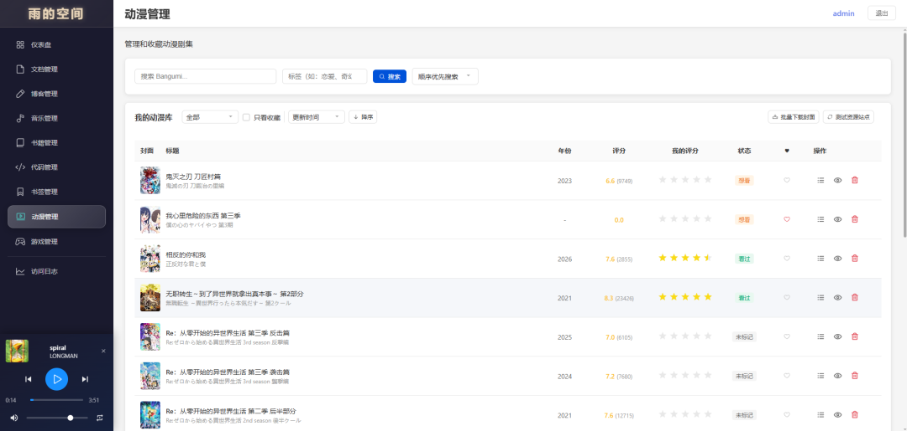
*动漫管理 - Bangumi数据，支持状态标记和评分*

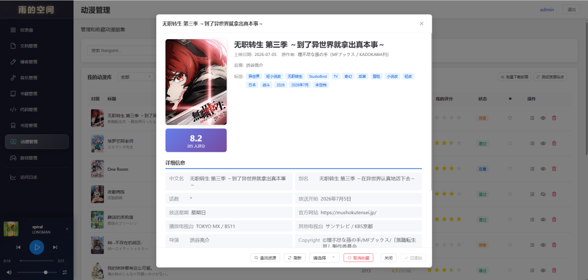
*动漫详情 - 角色声优、关联作品、资源搜索*

---

**多源资源搜索实现**：

支持两种搜索模式：

```javascript
// 1. 并行搜索（同时多源）
async function parallelSearch(keyword) {
  const results = await Promise.allSettled([
    searchNyaa(keyword),
    searchDMHY(keyword),
    searchAcgRip(keyword),
    searchMikan(keyword)
  ])
  
  return {
    nyaa: results[0].status === 'fulfilled' ? results[0].value : [],
    dmhy: results[1].status === 'fulfilled' ? results[1].value : [],
    acgrip: results[2].status === 'fulfilled' ? results[2].value : [],
    mikan: results[3].status === 'fulfilled' ? results[3].value : []
  }
}

// 2. 顺序优先搜索（按优先级依次尝试）
async function sequentialSearch(keyword) {
  const sources = ['nyaa', 'dmhy', 'acgrip', 'mikan']
  
  for (const source of sources) {
    try {
      const results = await searchBySource(source, keyword)
      if (results.length > 0) {
        return { source, results }
      }
    } catch (error) {
      console.error(`${source} 搜索失败:`, error)
    }
  }
  
  return { source: null, results: [] }
}
```

---

### 🎮 游戏管理模块

**核心功能**：
- **Steam 集成**：导入 Steam 库中的游戏
- **成就追踪**：查看游戏成就完成度
- **游戏状态**：想玩、在玩、通关
- **游戏信息**：封面、简介、游戏时长

**界面预览**：


*游戏管理 - Steam库同步，状态标记，评分*


*游戏详情 - 成就追踪，游戏统计*

---

## 三、安全与权限系统（新增）

### 权限管理系统

实现了完整的权限管理系统，支持**管理员**和**游客**两种角色。

#### 管理员
- 拥有完整的读写权限
- 可以执行所有操作，包括创建、更新、删除等
- 可以修改密码
- Token 有效期：7天（可配置）
- 登录方式：用户名 + 密码登录

#### 游客
- 只拥有只读权限
- 可以浏览所有资源
- 无法执行任何写操作（创建、更新、删除）
- Token 有效期：24小时
- 登录方式：点击"游客访问"按钮
- 使用 sessionStorage 存储 token（关闭浏览器后自动清除）

**后端权限中间件**：

```javascript
// 认证中间件
function authenticateToken(req, res, next) {
  const token = req.headers.authorization?.split(' ')[1]
  
  if (!token) {
    return res.status(401).json({ message: '未登录' })
  }
  
  try {
    const decoded = jwt.verify(token, JWT_SECRET)
    req.user = decoded
    next()
  } catch (error) {
    return res.status(401).json({ message: 'Token无效' })
  }
}

// 写权限检查
function requireWritePermission(req, res, next) {
  if (req.user.isGuest) {
    return res.status(403).json({
      message: '游客无权执行此操作',
      code: 'GUEST_NO_PERMISSION'
    })
  }
  next()
}

// 路由保护
router.post('/documents/upload', authenticateToken, requireWritePermission, uploadDocument)
```

---

### 安全加固措施

#### 1. 速率限制策略

使用 `express-rate-limit` 实现多级速率限制：

| 接口类型 | 限制规则 | 说明 |
|---------|---------|------|
| **登录接口** | 5次/5分钟 | 防止暴力破解密码 |
| **私密空间密码** | 3次/5分钟 | 防止暴力破解私密空间 |
| **写操作** | 20次/分钟 | 管理员操作，正常使用不会触发 |
| **读操作** | 200次/分钟 | 正常浏览，防止爬虫滥用 |
| **Bangumi API** | 15次/分钟 | 外部API调用 |
| **资源爬虫** | 5次/分钟 | Nyaa/DMHY等，非常严格 |

**缓存绕过机制**：缓存命中的请求不消耗速率限制次数。

```javascript
// 智能速率限制
export const scraperLimiter = rateLimit({
  windowMs: 60 * 1000,
  max: 5,
  skip: (req) => req.cacheHit === true, // 缓存命中跳过
  keyGenerator: (req) => {
    const userId = req.user?.id || 'anonymous'
    return `scraper-${userId}-${req.ip}`
  }
})
```

#### 2. 安全响应头

使用 Helmet 中间件添加安全头：

```javascript
import helmet from 'helmet'

app.use(helmet({
  frameguard: { action: 'deny' },        // 防止点击劫持
  contentSecurityPolicy: {                // 内容安全策略
    directives: {
      defaultSrc: ["'self'"],
      scriptSrc: ["'self'", "'unsafe-inline'"],
      styleSrc: ["'self'", "'unsafe-inline'"]
    }
  },
  xssFilter: true,                        // XSS 过滤器
  noSniff: true                           // 防止 MIME 嗅探
}))
```

#### 3. CORS 限制

**生产环境**：只允许白名单域名访问  
**开发环境**：允许所有来源（方便调试）

```javascript
const corsOptions = {
  origin: (origin, callback) => {
    const allowedOrigins = process.env.CORS_ORIGIN?.split(',') || []
    
    if (process.env.NODE_ENV === 'development') {
      callback(null, true) // 开发环境允许所有
    } else if (!origin || allowedOrigins.includes(origin)) {
      callback(null, true)
    } else {
      callback(new Error('不允许的来源'))
    }
  },
  credentials: true
}

app.use(cors(corsOptions))
```

---

## 四、性能优化（新增）

### Redis 缓存系统

集成 Redis 缓存，用于提升接口响应速度、降低数据库压力。

#### 核心收益

| 优化项 | 优化前 | 优化后 | 提升 |
|--------|--------|--------|------|
| 外部API调用 | 1-5秒 | 10-50ms | 90%+ |
| 数据库查询 | 100-500ms | 10-50ms | 70%+ |
| Git命令执行 | 100-800ms | 10-50ms | 80%+ |

#### 已缓存接口

覆盖 9 个模块，24 个接口：

| 模块 | 接口 | TTL |
|------|------|-----|
| 文档管理 | 分类列表、标签列表 | 5-10分钟 |
| 音乐管理 | 艺术家列表、专辑列表 | 30分钟 |
| 动漫管理 | Bangumi搜索、动漫详情、资源搜索 | 30分钟-1小时 |
| 代码管理 | GitHub信息、README、提交历史 | 5-30分钟 |
| 博客管理 | 文章列表、分类树、标签列表 | 5-30分钟 |

#### 缓存实现

```javascript
import { cache, CacheTTL } from '../utils/cache.js'

// 缓存中间件
async function withCache(req, res, next, cacheKey, ttl, fetchFn) {
  // 1. 尝试从缓存获取
  const cached = await cache.get(cacheKey)
  if (cached) {
    req.cacheHit = true // 标记缓存命中
    return res.json(cached)
  }
  
  // 2. 执行查询
  const data = await fetchFn()
  
  // 3. 保存到缓存
  await cache.set(cacheKey, data, ttl)
  
  res.json(data)
}

// 使用示例
router.get('/categories', async (req, res, next) => {
  const cacheKey = 'doc:categories'
  await withCache(req, res, next, cacheKey, CacheTTL.MEDIUM, async () => {
    return await db.prepare('SELECT * FROM categories').all()
  })
})
```

#### 自动降级机制

当 Redis 不可用时，系统会自动降级到内存缓存：

```javascript
class CacheManager {
  constructor() {
    this.redisClient = null
    this.memoryCache = new Map()
  }
  
  async get(key) {
    // 优先使用 Redis
    if (this.redisClient) {
      try {
        const data = await this.redisClient.get(key)
        if (data) return JSON.parse(data)
      } catch (error) {
        console.error('[Redis] 读取失败，降级到内存缓存')
      }
    }
    
    // 降级到内存缓存
    return this.memoryCache.get(key)
  }
  
  async set(key, value, ttl) {
    // 双写：Redis + 内存
    if (this.redisClient) {
      try {
        await this.redisClient.setex(key, ttl, JSON.stringify(value))
      } catch (error) {
        console.error('[Redis] 写入失败')
      }
    }
    
    // 内存缓存（带过期时间）
    this.memoryCache.set(key, value)
    setTimeout(() => this.memoryCache.delete(key), ttl * 1000)
  }
}
```

---

### 数据库索引优化

为常用查询字段创建索引：

```sql
-- 音乐表索引
CREATE INDEX idx_music_artist ON music(artist);
CREATE INDEX idx_music_album ON music(album);
CREATE INDEX idx_music_title ON music(title);
CREATE INDEX idx_music_created_at ON music(created_at);

-- 文档表索引
CREATE INDEX idx_documents_category ON documents(category);
CREATE INDEX idx_documents_title ON documents(title);

-- 动漫表索引
CREATE INDEX idx_anime_title ON anime(title);
CREATE INDEX idx_anime_status ON anime(status);

-- 博客表索引
CREATE INDEX idx_blog_posts_status ON blog_posts(status);
CREATE INDEX idx_blog_posts_created_at ON blog_posts(created_at);
```

---

## 五、开发过程中遇到的难点

### 难点1：SQLite从异步API迁移到同步API

**问题背景**：

最初使用 `sqlite3` 库（异步API），但在 Alpine Linux Docker 容器中编译原生模块失败。

**解决方案**：

迁移到 `better-sqlite3`（同步API），并改用 `slim` 镜像。

---

### 难点2：PDF预览功能的实现

**问题背景**：

1. PDF.js 4.0.379 使用私有字段，导致 Vite 打包失败
2. 二进制文件（PDF、Word等）需要通过后端返回 base64 编码

**解决方案**：

1. PDF.js 降级到 3.11.174 版本
2. 使用 CDN 加载 Worker 文件
3. 后端接口返回 base64 编码数据

```javascript
// 后端：支持二进制文件返回 base64
const binaryFormats = ['pdf', 'doc', 'docx', 'ppt', 'pptx', 'xls', 'xlsx', 'zip', 'rar']

if (binaryFormats.includes(ext)) {
  const fileBuffer = fs.readFileSync(filePath)
  const base64 = fileBuffer.toString('base64')
  return res.json({
    content: base64,
    isBase64: true,
    fileType: ext,
    fileName: document.file_name
  })
}

// 前端：处理 base64 PDF
function base64ToUint8Array(base64) {
  const binaryString = window.atob(base64)
  const bytes = new Uint8Array(binaryString.length)
  for (let i = 0; i < binaryString.length; i++) {
    bytes[i] = binaryString.charCodeAt(i)
  }
  return bytes
}

// PDF.js 配置
pdfjsLib.GlobalWorkerOptions.workerSrc = 'https://cdn.jsdelivr.net/npm/pdfjs-dist@3.11.174/build/pdf.worker.min.js'

const loadingTask = pdfjsLib.getDocument({ data: base64ToUint8Array(pdfBase64) })
```

---

### 难点3：音乐文件元数据解析

**解决方案**：

采用三层降级策略：

```
第一层：FFprobe（推荐，需要安装 FFmpeg）
   ↓ 失败
第二层：轻量级纯 JS 解析（无需外部依赖）
   ↓ 失败
第三层：文件名推断（兜底）
```

---

### 难点4：Bangumi 爬虫与代理配置

**解决方案**：

部署 Clash 代理，后端使用 `https-proxy-agent` 代理请求。

---

### 难点5：阅读进度保存问题

**问题背景**：

电子书阅读器在打开时会错误保存初始值，导致进度丢失。根本原因是 `visibilitychange` 事件在对话框打开时立即触发，此时滚动位置还是初始值 0。

**解决方案**：

1. 添加 `isProgressLoaded` 标志位
2. 延迟设置 `currentBook`，等待进度加载完成
3. 所有保存函数检查标志位
4. 添加数据库 `user_id` 字段支持多用户进度隔离

```javascript
// 防止初始值被错误保存
let isProgressLoaded = false

// 进度加载完成后再设置 currentBook
async function loadProgress() {
  const progress = await api.books.getProgress(bookId)
  if (progress) {
    currentPage.value = progress.currentPage
    // ... 恢复其他设置
  }
  isProgressLoaded = true
  currentBook.value = book
}

// 保存前检查标志位
function saveProgress() {
  if (!isProgressLoaded) return
  // ... 执行保存
}
```

### 难点6：分类拖拽排序实现

**问题背景**：

需要实现直观的分类拖拽排序功能。

**解决方案**：

使用 HTML5 原生拖拽 API：

```javascript
// 拖拽开始
dragstartHandler(e, category) {
  e.dataTransfer.effectAllowed = 'move'
  draggedItem.value = category
  e.target.style.opacity = '0.5'
}

// 拖拽经过
dragoverHandler(e, targetCategory) {
  e.preventDefault()
  e.dataTransfer.dropEffect = 'move'
  // 显示放置指示线
  dropIndicator.value = targetCategory.id
}

// 放置
dropHandler(e, targetCategory) {
  e.preventDefault()
  if (draggedItem.value.id === targetCategory.id) return
  
  // 重新排序
  const newOrder = reorderCategories(categories.value, draggedItem.value, targetCategory)
  
  // 批量更新数据库
  await api.categories.reorder(newOrder)
}
```

数据库表添加 `sort_order` 字段，后端使用事务批量更新。

---

### 难点6：速率限制的信任代理问题

**问题背景**：

使用反向代理后，`express-rate-limit` 报错 `ERR_ERL_UNEXPECTED_X_FORWARDED_FOR`。

**解决方案**：

在 Express 应用中配置信任代理：

```javascript
// 信任第一层代理
app.set('trust proxy', 1)
```

---

## 六、部署架构

### 系统截图展示


### NAS 部署

**目录结构**：

```
/data/PersonalResourceManager/
├── db/                    # 数据库文件
├── docs/                  # 文档存储
├── music/                 # 音乐文件
├── books/                 # 电子书
├── uploads/               # 上传文件
├── backend/               # 后端代码
├── frontend/              # 前端代码
└── docker-compose.yml
```

**Docker Compose 配置**（针对极空间 NAS 优化）：

极空间 NAS 的 SMB/NFS 共享默认是只读的，无法直接挂载到 Docker 容器进行写入操作。

**解决方案**：使用 Docker Volumes 存储数据，数据存储在 NAS 的 Docker 管理目录中。

```yaml
version: '3.8'

services:
  backend:
    build: ./backend
    container_name: pr-manager-backend
    restart: unless-stopped
    ports:
      - "3000:3000"
    volumes:
      # 使用 Docker 卷存储数据（适合极空间 NAS）
      - pr-data:/app/data
      - pr-db:/app/data/database
      - pr-docs:/app/data/documents
      - pr-music:/app/data/music
      - pr-uploads:/app/data/uploads
      - pr-logs:/app/data/logs
    environment:
      - NODE_ENV=production
      - JWT_SECRET=${JWT_SECRET}
      - DEFAULT_USERNAME=${DEFAULT_USERNAME:-admin}
      - DEFAULT_PASSWORD=${DEFAULT_PASSWORD:-admin123}
      - HTTP_PROXY=http://clash:7890
    networks:
      - pr-network

  frontend:
    build: ./frontend
    container_name: pr-manager-frontend
    restart: unless-stopped
    ports:
      - "5173:80"
    depends_on:
      - backend
    networks:
      - pr-network

  redis:
    image: redis:7-alpine
    container_name: pr-manager-redis
    restart: unless-stopped
    volumes:
      - redis-data:/data
    networks:
      - pr-network

networks:
  pr-network:
    external: true

volumes:
  pr-data:
  pr-db:
  pr-docs:
  pr-music:
  pr-uploads:
  pr-logs:
  redis-data:
```

**前端 Dockerfile**（使用 node:18-slim 避免 Alpine 兼容性问题）：

```dockerfile
FROM node:18-slim as build-stage

WORKDIR /app
COPY package*.json ./
RUN npm install --force
COPY . .
RUN npm run build

FROM nginx:stable-alpine as production-stage
COPY --from=build-stage /app/dist /usr/share/nginx/html
COPY nginx.conf /etc/nginx/conf.d/default.conf

EXPOSE 80
CMD ["nginx", "-g", "daemon off;"]
```

### 快速开始

```bash
# 1. 克隆项目
git clone <repository-url>
cd PersonalResourceManager

# 2. 配置环境变量
cp .env.example .env
# 编辑 .env 文件，设置 JWT_SECRET 等

# 3. 启动服务（极空间 NAS）
docker-compose -f docker-compose.nas.yml up -d --build

# 4. 查看日志
docker-compose -f docker-compose.nas.yml logs -f

# 5. 访问应用
# 前端: http://your-nas-ip:5173
# 后端: http://your-nas-ip:3000
```

**默认登录**：
- 用户名：`admin`
- 密码：`admin123`

⚠️ **重要**：首次登录后请立即修改密码！

---

## 七、未来规划

### 已完成功能

- ✅ Redis 缓存系统
- ✅ 权限管理系统（管理员 + 游客）
- ✅ 歌词功能（多源搜索、双语歌词、全屏歌词窗口）
- ✅ 音乐均衡器（10段均衡器、预设方案）
- ✅ 动漫多源资源搜索
- ✅ 安全加固（速率限制、安全头、CORS）
- ✅ 性能优化（数据库索引、查询优化）
- ✅ 移动端适配（全部模块响应式适配）
- ✅ 分类拖拽排序
- ✅ PDF 预览功能修复
- ✅ 阅读进度保存修复（支持多用户隔离）

### 移动端适配（已完成 ✅）

为所有模块添加了完整的移动端适配：

| 模块 | PC端 | 移动端 |
|------|------|--------|
| 全局播放器 | 底部固定播放栏 | 底部浮动播放栏 + 全屏播放器 |
| 音乐管理 | 表格布局 + 侧边歌单 | 卡片列表 + 歌单抽屉 |
| 文档管理 | 表格 + 分类树 | 卡片 + 下拉分类筛选 |
| 博客管理 | 分屏编辑器 | 响应式编辑器 + 卡片列表 |
| 书籍管理 | 封面/列表双视图 | 瀑布流卡片布局 |
| 游戏管理 | 表格布局 | 卡片网格 + 筛选抽屉 |
| 动漫管理 | 表格 + 搜索卡片 | 卡片列表 + 全屏详情 |
| 代码管理 | 文件树 + 分屏 | 列表 + 全屏预览 |
| 书签管理 | 表格布局 | 卡片列表 |

**实现方案**：
- 使用 `window.innerWidth` 检测设备类型
- PC/移动端组件分离（`MusicPC.vue` / `MusicMobile.vue`）
- 使用 `@media` CSS 媒体查询处理响应式布局
- 移动端优先使用原生组件（避免 TDesign 移动端兼容性问题）

### 待实现功能

1. **全文搜索**：集成 SQLite FTS5 全文搜索引擎
2. **数据导出**：支持导出为 Markdown/JSON
3. **API 开放**：提供公开 API，支持第三方集成

---

## 八、从零搭建教程

### 步骤一：环境准备

**1. 安装 Docker 和 Docker Compose**

```bash
# Ubuntu/Debian
sudo apt update
sudo apt install -y docker.io docker-compose

# 启动 Docker 服务
sudo systemctl start docker
sudo systemctl enable docker
```

**2. 安装 Git**

```bash
sudo apt install -y git
```

### 步骤二：下载项目

```bash
# 克隆项目
git clone <your-repository-url>
cd PersonalResourceManager

# 查看项目结构
ls -la
```

### 步骤三：配置环境变量

```bash
# 复制环境变量模板
cp .env.example .env

# 编辑 .env 文件
vim .env
```

**环境变量配置示例**：

```env
# JWT 密钥（必须修改，至少32位随机字符串）
JWT_SECRET=your-very-secret-random-string-at-least-32-characters

# 默认登录账号
DEFAULT_USERNAME=admin
DEFAULT_PASSWORD=admin123

# CORS 配置（生产环境修改为实际域名）
CORS_ORIGIN=*

# 代理配置（访问 Bangumi API 需要）
HTTP_PROXY=http://clash:7890
```

### 步骤四：启动服务

```bash
# 构建并启动容器
docker-compose -f docker-compose.nas.yml up -d --build

# 查看启动状态
docker-compose -f docker-compose.nas.yml ps

# 查看日志（排查问题）
docker-compose -f docker-compose.nas.yml logs -f
```

### 步骤五：初始化配置

**1. 配置 Clash 代理（可选，用于动漫搜索）**

```bash
# 启动 Clash
docker-compose -f docker-compose.clash.yml up -d

# 查看 Clash 面板
# 访问 http://your-nas-ip:7892/ui
```

**2. 配置 FFmpeg（音乐元数据解析）**

```bash
# 进入后端容器
docker exec -it pr-manager-backend sh

# 安装 FFmpeg
apk add --no-cache ffmpeg

# 验证安装
ffmpeg -version
```

### 步骤六：访问系统

```
前端界面：http://your-server-ip:5173
后端 API：http://your-server-ip:3000/api

默认登录：
- 用户名：admin
- 密码：admin123
```

### 步骤七：功能配置

**1. 音乐模块配置**
- 上传音乐文件
- 系统自动解析元数据（需要 FFmpeg）
- 搜索歌词（需要代理）

**2. 动漫模块配置**
- 配置 Bangumi API（无需 API Key）
- 配置 Clash 代理（推荐）
- 开始搜索和导入动漫

**3. 游戏模块配置**
- 获取 Steam API Key：https://steamcommunity.com/dev/apikey
- 获取 Steam ID：https://steamid.io
- 配置后同步游戏库

**4. 书籍模块配置**
- 直接上传 EPUB/PDF/TXT 文件
- 系统自动解析 EPUB 元数据

### 步骤八：数据备份

```bash
# 备份数据库
docker run --rm -v pr-db:/data -v $(pwd):/backup alpine \
  tar czf /backup/db-backup-$(date +%Y%m%d).tar.gz /data

# 备份所有数据
docker run --rm -v pr-data:/data -v $(pwd):/backup alpine \
  tar czf /backup/full-backup-$(date +%Y%m%d).tar.gz /data
```

### 常见问题

**Q1: 容器启动失败**
```bash
# 检查日志
docker-compose logs backend
docker-compose logs frontend

# 常见原因：端口被占用、权限不足
```

**Q2: 无法访问 Bangumi API**
```bash
# 检查代理配置
curl -x http://clash:7890 https://api.bgm.tv

# 检查后端环境变量是否正确设置 HTTP_PROXY
```

**Q3: 音乐元数据解析失败**
```bash
# 检查 FFmpeg 是否安装
docker exec pr-manager-backend ffmpeg -version

# 检查文件权限
```

---

## 九、总结

### 项目成果

通过这个项目，我收获了很多：

1. ✅ **全栈开发能力**：从前端到后端到部署，完整闭环
2. ✅ **数据库设计经验**：从表结构到索引优化
3. ✅ **Docker 实践**：容器化部署、网络配置
4. ✅ **安全意识**：速率限制、安全头、权限控制
5. ✅ **性能优化**：缓存策略、查询优化
6. ✅ **问题解决能力**：遇到问题独立分析和解决

### 技术心得

1. **技术选型很重要**：选择成熟稳定的技术栈，避免踩坑
2. **架构设计要留余地**：考虑未来扩展性
3. **代码质量要重视**：注释、文档、测试缺一不可
4. **用户体验要关注**：性能优化、交互细节
5. **安全防护不能少**：生产环境必须做安全加固
6. **缓存是性能利器**：合理的缓存策略能大幅提升性能

### 开源分享

如果你也想搭建类似的系统，希望这篇文章能给你一些启发！

---

**最后更新时间**：2026-06-01  
**项目状态**：✅ 持续开发中  
**版本**：v2.1.0

---

## 附录：关键文件索引

### 前端核心文件
- `frontend/src/views/Blog.vue` - 博客管理组件
- `frontend/src/views/Documents.vue` - 文档管理组件
- `frontend/src/views/Music.vue` - 音乐管理组件
- `frontend/src/views/Books.vue` - 书籍阅读器
- `frontend/src/views/Anime.vue` - 动漫管理组件
- `frontend/src/components/MediaPlayer.vue` - 全局音乐播放器
- `frontend/src/components/LyricsWindow.vue` - 歌词窗口组件
- `frontend/src/components/EqualizerPanel.vue` - 均衡器面板组件

### 后端核心文件
- `backend/src/routes/blog.js` - 博客API
- `backend/src/routes/documents.js` - 文档API
- `backend/src/routes/music.js` - 音乐API（含 FFprobe 解析、歌词）
- `backend/src/routes/anime.js` - 动漫爬虫
- `backend/src/middlewares/auth.js` - 认证中间件
- `backend/src/middlewares/security.js` - 安全中间件
- `backend/src/config/database.js` - 数据库初始化
- `backend/src/utils/cache.js` - 缓存工具类
- `backend/src/utils/redis.js` - Redis连接管理

### 配置文件
- `docker-compose.yml` - 主部署配置
- `docker-compose.clash.yml` - 代理配置
- `.env.production` - 生产环境变量

### 文档文件
- `docs/QUICKSTART.md` - 快速开始指南
- `docs/NAS_DEPLOYMENT.md` - 极空间 NAS 部署指南
- `docs/DATABASE_SCHEMA.md` - 数据库表结构
- `docs/CLASH_DEPLOYMENT.md` - 代理部署指南
- `docs/FFMPEG_SETUP.md` - FFmpeg 安装说明
- `docs/REDIS_CACHE_GUIDE.md` - Redis缓存指南
- `docs/PERMISSION_SYSTEM.md` - 权限系统说明
- `docs/LYRICS_FEATURE.md` - 歌词功能文档
- `docs/SECURITY_HARDENING_GUIDE.md` - 安全加固指南
- `docs/EXTERNAL_API_RATE_LIMIT.md` - 外部API速率限制说明
- `docs/MUSIC_MANAGEMENT.md` - 音乐管理模块文档
- `docs/BOOKS_MANAGEMENT.md` - 书籍管理模块文档
- `docs/DOCUMENTS_MANAGEMENT.md` - 文档管理模块文档
- `docs/GAMES_MANAGEMENT.md` - 游戏管理模块文档
- `docs/ANIME_MANAGEMENT.md` - 动漫管理模块文档
- `docs/BLOG_MANAGEMENT.md` - 博客管理模块文档
- `docs/CODE_MANAGEMENT.md` - 代码管理模块文档
- `docs/BOOKMARKS_FEATURE.md` - 书签管理模块文档
