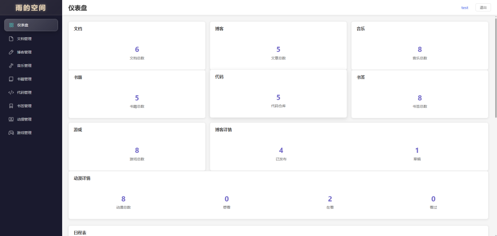
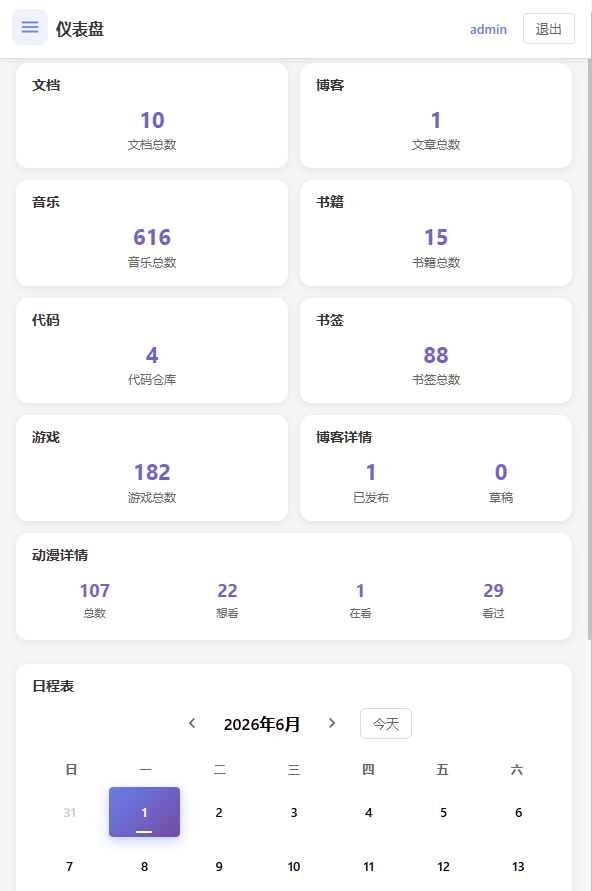

# 仪表盘模块

## 一、功能概述

仪表盘模块提供系统资源统计概览，展示各模块的数据统计、最近动态、存储使用情况等，帮助用户快速了解系统整体状态。



**移动端界面：**



*移动端仪表盘 - 卡片网格布局，日程表*

## 二、统计数据

### 1. 资源统计

| 模块 | 统计项 | 说明 |
|------|--------|------|
| 文档管理 | 文档总数 | 所有文档数量 |
| 博客管理 | 文章总数/已发布/草稿 | 文章分类统计 |
| 音乐管理 | 音乐总数 | 所有音乐文件数量 |
| 书籍管理 | 书籍总数 | 所有书籍数量 |
| 代码管理 | 代码仓库 | 仓库数量 |
| 书签管理 | 书签总数 | 所有书签数量 |
| 游戏管理 | 游戏总数 | 游戏数量 |
| 动漫管理 | 动漫总数/收藏/想看/看过 | 动漫状态统计 |

### 2. 存储统计

| 存储项 | 说明 |
|--------|------|
| 数据库大小 | SQLite 数据库文件大小 |
| 文档存储 | 文档文件总大小 |
| 音乐存储 | 音乐文件总大小 |
| 书籍存储 | 电子书文件总大小 |
| 上传目录 | 其他上传文件大小 |
| 总存储 | 以上所有之和 |

---

## 三、前端页面功能

### 1. 资源统计卡片

**第一行（6 列）**：

- **文档**：文档总数
- **博客**：文章总数
- **音乐**：音乐总数
- **书籍**：书籍总数
- **代码**：代码仓库数量
- **书签**：书签总数

**第二行（详情统计）**：

- **游戏**：游戏总数
- **博客详情**：
  - 已发布数量
  - 草稿数量
- **动漫详情**：
  - 动漫总数
  - 收藏数量
  - 想看数量
  - 看过数量

### 2. 存储使用概览

- **数据库大小**：SQLite 数据库文件大小
- **文件存储**：
  - 文档存储大小
  - 音乐存储大小
  - 书籍存储大小
  - 其他上传文件大小
- **总计**：所有文件总大小

### 3. 最近活动

显示最近添加的资源：

- 最近文档（前 5 条）
- 最近音乐（前 5 条）
- 最近书籍（前 5 条）

---

## 四、前端架构

### PC/移动端分离架构

采用条件渲染方式实现响应式适配：

**主入口文件** (`frontend/src/views/Dashboard.vue`):
```vue
<template>
  <DashboardMobile v-if="isMobile" />
  <div v-else class="dashboard">
    <!-- PC端内容 -->
  </div>
</template>
```

**PC端组件** (`frontend/src/pc/pages/DashboardPC.vue`):
- 统计卡片网格布局（6列）
- 日程表双栏布局（日历+待办）
- 最近活动列表

**移动端组件** (`frontend/src/mobile/pages/DashboardMobile.vue`):
- 统计卡片垂直堆叠
- 日程表单栏布局
- 底部快捷操作
- 待办事项滑动操作

---

## 五、API 接口

### 统计接口

各模块的统计接口：

| 模块 | 接口 | 返回数据 |
|------|------|----------|
| 文档 | `GET /api/documents/stats` | `{ total }` |
| 博客 | `GET /api/blog/stats` | `{ total, published, draft }` |
| 音乐 | `GET /api/music/stats` | `{ total }` |
| 书籍 | `GET /api/ebooks/stats` | `{ total }` |
| 代码 | `GET /api/code/stats` | `{ total }` |
| 书签 | `GET /api/bookmarks/stats` | `{ total }` |
| 游戏 | `GET /api/games/stats` | `{ total }` |
| 动漫 | `GET /api/anime/stats` | `{ total, favorite, watching, watched }` |

---

## 六、技术实现细节

### 1. 统计数据获取

```javascript
// 前端并行获取所有统计数据
async function loadStats() {
  const [
    documentsRes,
    blogRes,
    musicRes,
    booksRes,
    codeRes,
    bookmarksRes,
    gamesRes,
    animeRes
  ] = await Promise.all([
    api.documents.getStats(),
    api.blog.getStats(),
    api.music.getStats(),
    api.books.getStats(),
    api.code.getStats(),
    api.bookmarks.getStats(),
    api.games.getStats(),
    api.anime.getStats()
  ])

  stats.value = {
    documents: documentsRes.data.total,
    blog: blogRes.data,
    music: musicRes.data.total,
    books: booksRes.data.total,
    code: codeRes.data.total,
    bookmarks: bookmarksRes.data.total,
    games: gamesRes.data.total,
    anime: animeRes.data
  }
}
```

### 2. 后端统计实现

```javascript
// 文档统计
router.get('/documents/stats', authenticateToken, (req, res) => {
  const db = getDatabase()
  const total = db.prepare('SELECT COUNT(*) as count FROM documents').get().count
  res.json({ data: { total } })
})

// 博客统计
router.get('/blog/stats', authenticateToken, (req, res) => {
  const db = getDatabase()
  const total = db.prepare('SELECT COUNT(*) as count FROM blog_posts').get().count
  const published = db.prepare('SELECT COUNT(*) as count FROM blog_posts WHERE status = ?').get('published').count
  const draft = db.prepare('SELECT COUNT(*) as count FROM blog_posts WHERE status = ?').get('draft').count
  res.json({ data: { total, published, draft } })
})

// 动漫统计
router.get('/anime/stats', authenticateToken, (req, res) => {
  const db = getDatabase()
  const total = db.prepare('SELECT COUNT(*) as count FROM anime').get().count
  const favorite = db.prepare('SELECT COUNT(*) as count FROM anime WHERE is_favorite = 1').get().count
  const watching = db.prepare('SELECT COUNT(*) as count FROM anime WHERE status = ?').get('watching').count
  const watched = db.prepare('SELECT COUNT(*) as count FROM anime WHERE status = ?').get('watched').count
  res.json({ data: { total, favorite, watching, watched } })
})
```

### 3. 存储大小计算

```javascript
// 计算目录大小
function getDirectorySize(dirPath) {
  let size = 0
  try {
    const files = fs.readdirSync(dirPath)
    for (const file of files) {
      const filePath = path.join(dirPath, file)
      const stats = fs.statSync(filePath)
      if (stats.isDirectory()) {
        size += getDirectorySize(filePath)
      } else {
        size += stats.size
      }
    }
  } catch (e) {
    // 忽略无法访问的目录
  }
  return size
}

// 格式化文件大小
function formatSize(bytes) {
  if (bytes === 0) return '0 B'
  const k = 1024
  const sizes = ['B', 'KB', 'MB', 'GB', 'TB']
  const i = Math.floor(Math.log(bytes) / Math.log(k))
  return parseFloat((bytes / Math.pow(k, i)).toFixed(2)) + ' ' + sizes[i]
}
```

---

## 七、配置说明

### 数据刷新频率

- 页面加载时自动获取
- 可手动刷新
- 不支持自动定时刷新

### 显示设置

- 卡片布局：响应式设计，自动适应屏幕宽度
- 数据精度：数字不进行格式化，直接显示原始数据

---

## 八、关键文件路径

| 功能模块 | 文件路径 |
|----------|----------|
| 前端视图 | `frontend/src/views/Dashboard.vue` |
| PC端组件 | `frontend/src/pc/pages/DashboardPC.vue` |
| 移动端组件 | `frontend/src/mobile/pages/DashboardMobile.vue` |
| API 定义 | `frontend/src/api/index.js` |

---

## 九、使用说明

### 查看统计

1. 进入首页（仪表盘）
2. 自动加载所有统计数据
3. 查看各模块的资源数量

### 刷新数据

- 点击刷新按钮重新获取数据
- 或切换页面后返回自动刷新

---

## 九、注意事项

1. **加载性能**：
   - 并行请求所有统计接口
   - 单个接口失败不影响其他
   - 总加载时间取决于最慢的接口

2. **数据一致性**：
   - 统计数据实时获取
   - 不使用缓存
   - 可能与实际有轻微延迟

3. **权限要求**：
   - 所有统计接口需要登录
   - 使用 JWT 认证

4. **存储统计**：
   - 需要文件系统访问权限
   - 大目录计算可能耗时
   - 建议缓存结果

---

## 十、日程表功能

日程表模块集成在仪表盘中，提供日历视图和待办事项管理功能。

### 1. 功能概述

| 功能 | 说明 |
|------|------|
| 日历视图 | 月视图展示，支持农历/节气/节日显示 |
| 待办管理 | 添加、编辑、删除待办事项 |
| 状态管理 | 完成/未完成状态切换 |
| 确认锁定 | 确认后内容锁定，需点击编辑修改 |
| 日期标记 | 有待办的日期显示小圆点标记 |

### 2. 数据库结构

**todos - 待办事项表**

| 字段名 | 类型 | 约束 | 默认值 | 说明 |
|--------|------|------|--------|------|
| id | INTEGER | PRIMARY KEY AUTOINCREMENT | - | 待办ID |
| text | TEXT | NOT NULL | - | 待办内容 |
| date | TEXT | NOT NULL | - | 日期（YYYY-MM-DD） |
| completed | INTEGER | - | 0 | 是否完成（0/1） |
| confirmed | INTEGER | - | 0 | 是否确认（0/1） |
| created_at | DATETIME | - | CURRENT_TIMESTAMP | 创建时间 |
| updated_at | DATETIME | - | CURRENT_TIMESTAMP | 更新时间 |

### 3. API 接口

| 接口 | 方法 | 说明 |
|------|------|------|
| `/api/todos` | GET | 获取指定日期的待办事项（?date=YYYY-MM-DD） |
| `/api/todos/month` | GET | 获取月份范围内的待办事项（?startDate=&endDate=） |
| `/api/todos` | POST | 创建待办事项 |
| `/api/todos/:id` | PUT | 更新待办事项 |
| `/api/todos/:id` | DELETE | 删除待办事项 |

### 4. 前端功能

**日历组件**：
- 显示当前月份的日历网格（6行7列）
- 每个日期格子显示：
  - 公历日期（数字）
  - 农历日期/节气/节日（使用 `lunar-javascript` 库）
  - 待办标记（蓝色小圆点）
- 特殊样式：
  - 今天：渐变紫色背景
  - 选中：淡紫色背景
  - 有待办：右上角小圆点
  - 节日：农历显示红色

**待办列表**：
- 显示选中日期的所有待办事项
- 每个待办项包含：
  - 完成状态复选框
  - 待办内容输入框
  - 确认按钮（未确认时显示）
  - 编辑/保存按钮（已确认时显示）
  - 删除按钮

### 5. 技术实现

**农历计算**（使用 `lunar-javascript` 库）：

```javascript
import { Solar } from 'lunar-javascript'

function getLunarInfo(year, month, day) {
  const solar = Solar.fromYmd(year, month, day)
  const lunar = solar.getLunar()
  
  // 获取节日
  const festivals = [...lunar.getFestivals(), ...solar.getFestivals()]
  
  // 获取节气
  const jieQi = lunar.getJieQi()
  
  // 获取农历日
  const lunarDay = lunar.getDayInChinese()
  
  if (festivals.length > 0) return { text: festivals[0], isFestival: true }
  if (jieQi) return { text: jieQi, isFestival: true }
  if (lunarDay === '初一') return { text: lunar.getMonthInChinese() + '月', isFestival: false }
  
  return { text: lunarDay, isFestival: false }
}
```

**待办状态流转**：

```
新建 → 编辑内容 → 确认(锁定) → 编辑 → 保存
                    ↓
                  完成/取消完成
                    ↓
                  删除
```

### 6. 关键文件路径

| 功能 | 文件路径 |
|------|----------|
| 前端视图 | `frontend/src/views/Dashboard.vue` |
| 后端路由 | `backend/src/routes/todos.js` |

---

## 十一、扩展建议

### 可添加的功能

1. **图表展示**：
   - 资源类型分布饼图
   - 时间趋势折线图
   - 存储使用柱状图

2. **最近活动时间线**：
   - 按时间排序所有模块的最近更新
   - 显示操作类型（添加/编辑/删除）

3. **快捷操作**：
   - 快速上传入口
   - 快速搜索入口
   - 快速添加入口

4. **数据导出**：
   - 导出统计报告
   - 导出资源列表
