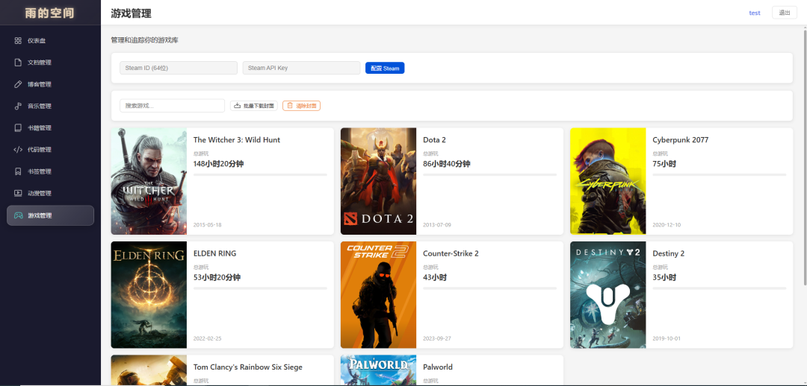
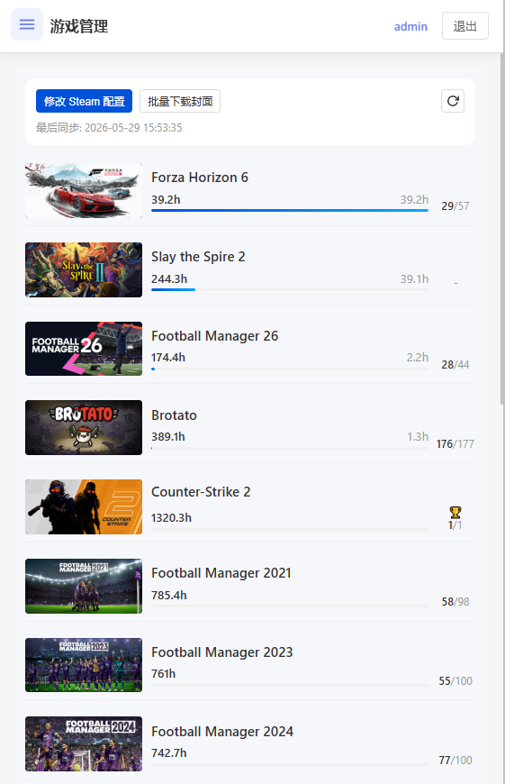
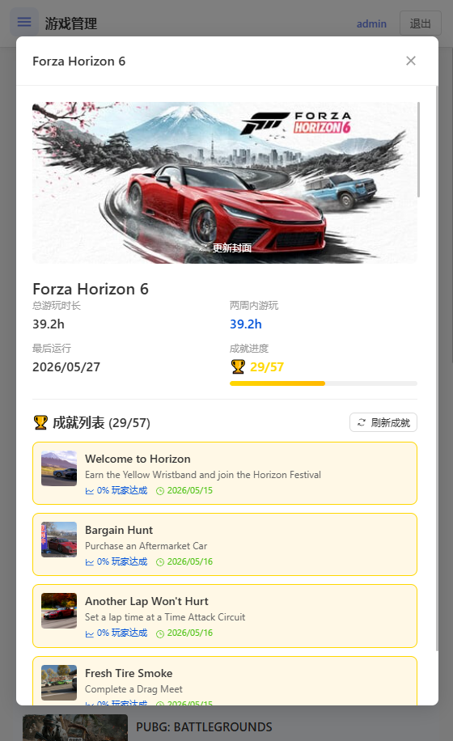
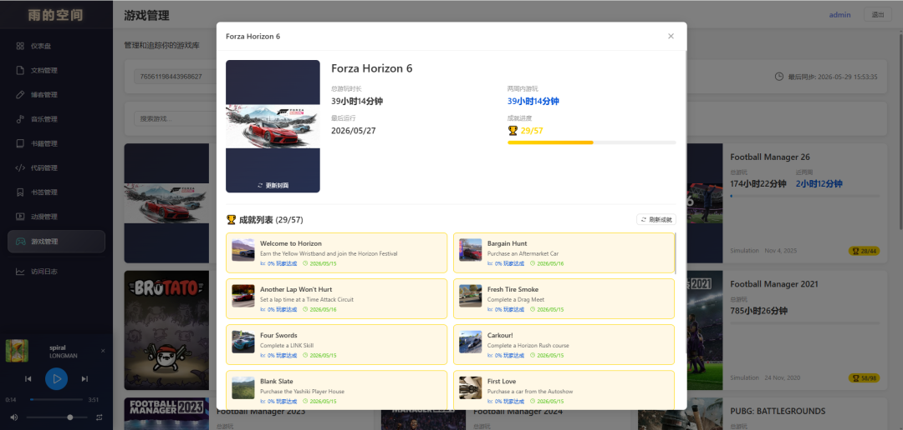

# 游戏管理模块

## 一、功能概述

游戏管理模块集成 Steam API，提供游戏库同步、成就追踪、游戏状态管理、评分、收藏等功能，支持自动获取游戏封面和详细信息。



**移动端界面：**



*移动端游戏列表 - 游戏时长进度条*



*移动端游戏详情 - 成就列表*

## 二、数据库结构

### 1. games 表（游戏主表）

| 字段名 | 类型 | 说明 |
|--------|------|------|
| id | INTEGER | 主键，自增 |
| steam_appid | INTEGER | Steam App ID，唯一 |
| title | TEXT | 游戏标题，必填 |
| name_original | TEXT | 原始名称 |
| description | TEXT | 游戏简介 |
| cover_image | TEXT | 封面图片 URL |
| cover_image_data | TEXT | 封面图片数据（base64） |
| developers | TEXT | 开发商（逗号分隔） |
| publishers | TEXT | 发行商（逗号分隔） |
| release_date | TEXT | 发行日期 |
| genres | TEXT | 游戏类型（逗号分隔） |
| platforms | TEXT | 支持平台（逗号分隔） |
| metacritic_score | INTEGER | Metacritic 评分 |
| metacritic_url | TEXT | Metacritic 链接 |
| playtime_forever | INTEGER | 总游玩时长（分钟） |
| playtime_2weeks | INTEGER | 两周内游玩时长（分钟） |
| last_played | DATETIME | 最后游玩时间 |
| status | TEXT | 状态：'unplayed' / 'playing' / 'played' / 'dropped' / 'wishlist' |
| is_favorite | INTEGER | 是否收藏，默认 0 |
| user_rating | INTEGER | 用户评分（0-10） |
| achievements_total | INTEGER | 成就总数 |
| achievements_completed | INTEGER | 已完成成就数 |
| notes | TEXT | 备注 |
| created_at | DATETIME | 创建时间 |
| updated_at | DATETIME | 更新时间 |

### 2. steam_config 表（Steam 配置表）

| 字段名 | 类型 | 说明 |
|--------|------|------|
| id | INTEGER | 主键，固定为 1 |
| steam_id | TEXT | Steam ID（17 位数字） |
| api_key | TEXT | Steam Web API Key |
| last_sync | DATETIME | 最后同步时间 |
| auto_sync | INTEGER | 是否自动同步，默认 0 |
| created_at | DATETIME | 创建时间 |
| updated_at | DATETIME | 更新时间 |

### 3. game_achievements 表（游戏成就表）

| 字段名 | 类型 | 说明 |
|--------|------|------|
| id | INTEGER | 主键，自增 |
| game_id | INTEGER | 游戏 ID，外键级联删除 |
| achievement_id | TEXT | 成就 ID（API 名称） |
| name | TEXT | 成就名称 |
| description | TEXT | 成就描述 |
| icon | TEXT | 成就图标 URL |
| icon_gray | TEXT | 未解锁图标 URL |
| is_achieved | INTEGER | 是否已解锁 |
| unlock_time | DATETIME | 解锁时间 |
| global_percent | REAL | 全球完成率 |

---

## 三、后端 API 接口

**路由文件**: `backend/src/routes/games.js`

### Steam 配置 API

| 方法 | 路由 | 功能 | 参数 |
|------|------|------|------|
| GET | `/steam/config` | 获取 Steam 配置 | - |
| POST | `/steam/config` | 保存 Steam 配置 | `{ steamId, apiKey }` |
| DELETE | `/steam/config` | 删除 Steam 配置 | - |
| POST | `/steam/sync` | 开始同步 | - |
| GET | `/steam/sync/:taskId` | 查询同步状态 | - |

### 游戏管理 API

| 方法 | 路由 | 功能 | 参数 |
|------|------|------|------|
| GET | `/` | 获取游戏列表 | `status`, `favorite`, `genre`, `platform`, `keyword`, `sortBy`, `sortOrder`, `page`, `pageSize` |
| GET | `/:id` | 获取游戏详情 | - |
| PUT | `/:id` | 更新游戏信息 | `{ status, isFavorite, userRating, notes }` |
| DELETE | `/:id` | 删除游戏 | - |
| POST | `/:id/favorite` | 切换收藏状态 | - |
| POST | `/:id/status` | 更新状态 | `{ status }` |
| POST | `/:id/rating` | 更新评分 | `{ rating }` |

### 成就管理 API

| 方法 | 路由 | 功能 | 参数 |
|------|------|------|------|
| GET | `/:id/achievements` | 获取成就列表 | - |
| POST | `/:id/fetch-achievements` | 获取/刷新成就数据 | - |

### 封面管理 API

| 方法 | 路由 | 功能 | 参数 |
|------|------|------|------|
| POST | `/batch-download-covers` | 批量下载封面 | - |
| POST | `/clear-covers` | 清除所有封面 | - |
| POST | `/:id/refresh-cover` | 刷新单个封面 | - |
| GET | `/stats` | 获取统计数据 | - |

---

## 四、前端页面功能

### 1. Steam 配置

- **配置表单**：
  - Steam ID（17 位数字）
  - Steam Web API Key
  - 配置验证

- **同步控制**：
  - 同步按钮
  - 同步进度显示
  - 同步状态提示

### 2. 游戏列表

- **筛选功能**：
  - 状态筛选（未玩/正在玩/已玩/已弃坑/愿望单）
  - 只看收藏
  - 关键词搜索

- **排序方式**：
  - 默认：两周内游玩时长（热门在前）
  - 总游玩时长
  - 最后游玩时间
  - 评分

- **游戏卡片**：
  - 封面图片（纵向封面适配卡片）
  - 游戏标题
  - 游玩时长
  - 成就进度（已解锁/总数）
  - 收藏图标
  - 操作按钮

### 3. 游戏详情



- **基本信息**：
  - 游戏标题
  - 开发商/发行商
  - 发行日期
  - 游戏类型
  - 支持平台

- **游玩统计**：
  - 总游玩时长
  - 两周内游玩时长
  - 最后游玩时间

- **状态管理**：
  - 游戏状态切换
  - 收藏切换
  - 用户评分（1-5 星，支持半星）
  - 备注

### 4. 成就系统

- **成就列表**：
  - 成就图标（已解锁/未解锁）
  - 成就名称和描述
  - 解锁时间
  - 全球完成率

- **成就统计**：
  - 总成就数
  - 已解锁数
  - 完成百分比

---

## 五、前端架构

### PC/移动端分离架构

采用条件渲染方式实现响应式适配：

**主入口文件** (`frontend/src/views/Games.vue`):
```vue
<template>
  <GamesMobile v-if="isMobile" />
  <div v-else class="games">
    <!-- PC端内容 -->
  </div>
</template>
```

**PC端组件** (`frontend/src/pc/pages/GamesPC.vue`):
- 表格布局展示游戏列表
- Steam配置对话框
- 批量操作功能
- 表头排序支持

**移动端组件** (`frontend/src/mobile/pages/GamesMobile.vue`):
- 卡片网格布局
- 底部操作栏
- 筛选抽屉
- 同步进度显示

---

## 六、技术实现细节

### 1. Steam API 集成

```javascript
// Steam API 配置
const STEAM_API_BASE = 'https://api.steampowered.com'

// Steam API 不需要代理（国内可直接访问）
const steamAgent = undefined

// 获取游戏列表
async function getOwnedGames(steamId, apiKey) {
  const url = `${STEAM_API_BASE}/IPlayerService/GetOwnedGames/v1/?key=${apiKey}&steamid=${steamId}&include_appinfo=1&include_played_free_games=1`
  const response = await axios.get(url, { timeout: 60000 })
  return response.data.response.games || []
}
```

### 2. 封面下载（多层回退）

```javascript
async function downloadGameCover(steamAppId, title) {
  // 封面源列表（按优先级）
  const coverSources = [
    `https://steamcdn-a.akamaihd.net/steam/apps/${steamAppId}/library_600x900.jpg`,
    `https://steamcdn-a.akamaihd.net/steam/apps/${steamAppId}/library_600x900_2x.jpg`,
    `https://steamcdn-a.akamaihd.net/steam/apps/${steamAppId}/header.jpg`,
    `https://cdn.cloudflare.steamstatic.com/steam/apps/${steamAppId}/library_600x900.jpg`
  ]
  
  for (const url of coverSources) {
    try {
      const coverData = await downloadImageAsBase64(url)
      if (coverData) return coverData
    } catch (e) {
      continue
    }
  }
  
  // 最后尝试从 Store API 获取
  const storeUrl = `https://store.steampowered.com/api/appdetails?appids=${steamAppId}`
  const response = await axios.get(storeUrl, { timeout: 15000 })
  const appData = response.data[steamAppId]?.data
  return appData?.header_image || null
}
```

### 3. 成就获取（按需加载）

```javascript
async function fetchAchievements(gameId, steamAppId, steamId, apiKey) {
  // 1. 获取玩家成就
  const playerUrl = `${STEAM_API_BASE}/ISteamUserStats/GetPlayerAchievements/v1/?key=${apiKey}&steamid=${steamId}&appid=${steamAppId}`
  const playerResponse = await axios.get(playerUrl)
  const playerAchievements = playerResponse.data.playerstats?.achievements || []
  
  // 2. 获取成就定义（名称、描述、图标）
  const schemaUrl = `${STEAM_API_BASE}/ISteamUserStats/GetSchemaForGame/v2/?key=${apiKey}&appid=${steamAppId}`
  const schemaResponse = await axios.get(schemaUrl)
  const achievementDefs = schemaResponse.data.game?.availableGameStats?.achievements || []
  
  // 3. 获取全球完成率
  const globalUrl = `${STEAM_API_BASE}/ISteamUserStats/GetGlobalAchievementPercentagesForApp/v2/?gameid=${steamAppId}`
  const globalResponse = await axios.get(globalUrl)
  const globalPercents = globalResponse.data.achievementpercentages?.achievements || []
  
  // 4. 合并数据
  return playerAchievements.map(pa => {
    const def = achievementDefs.find(d => d.name === pa.apiname) || {}
    return {
      name: def.displayName || pa.apiname,
      description: def.description || '',
      icon: pa.achieved ? def.icon : def.icongray,
      is_achieved: pa.achieved,
      unlock_time: pa.unlocktime ? new Date(pa.unlocktime * 1000) : null,
      global_percent: globalPercents.find(g => g.name === pa.apiname)?.percent || 0
    }
  })
}
```

### 4. 异步任务管理

```javascript
// 同步任务管理器
const syncTasks = new Map()

function createTask() {
  const taskId = `sync_${Date.now()}_${Math.random().toString(36).substr(2, 9)}`
  const task = {
    id: taskId,
    status: 'pending',
    progress: 0,
    message: '等待开始...',
    startTime: null,
    endTime: null
  }
  syncTasks.set(taskId, task)
  return task
}

// 后台执行同步
async function executeSyncTask(taskId, steamId, apiKey) {
  updateTask(taskId, { status: 'running', message: '正在获取游戏列表...' })
  
  const games = await getOwnedGames(steamId, apiKey)
  
  // 使用事务批量处理
  const transaction = db.transaction(() => {
    for (const game of games) {
      // 插入或更新游戏
    }
  })
  
  updateTask(taskId, { status: 'completed', progress: 100 })
}
```

---

## 七、配置说明

### 环境变量

无特殊环境变量配置（Steam API 可直接访问）。

### Steam API Key 获取

1. 访问 https://steamcommunity.com/dev/apikey
2. 登录 Steam 账号
3. 填写域名（可填写 localhost）
4. 获取 API Key

### Steam ID 获取

1. 登录 Steam 客户端或网页
2. 点击个人资料
3. 查看 URL：`https://steamcommunity.com/profiles/[SteamID]`
4. 或使用 https://steamid.io 转换

---

## 八、关键文件路径

| 功能模块 | 文件路径 |
|----------|----------|
| 后端路由 | `backend/src/routes/games.js` |
| 前端视图 | `frontend/src/views/Games.vue` |
| PC端组件 | `frontend/src/pc/pages/GamesPC.vue` |
| 移动端组件 | `frontend/src/mobile/pages/GamesMobile.vue` |
| API 定义 | `frontend/src/api/index.js` |

---

## 九、使用说明

### 1. 配置 Steam

1. 点击"配置 Steam"按钮
2. 输入 Steam ID（17 位数字）
3. 输入 Steam Web API Key
4. 点击"保存并验证"
5. 验证成功后显示"同步游戏库"按钮

### 2. 同步游戏库

1. 点击"同步游戏库"按钮
2. 等待同步完成
3. 显示同步结果（新增数量、更新数量）

### 3. 管理游戏

- **状态切换**：鼠标悬停状态列，选择状态
- **收藏切换**：点击心形图标
- **评分**：点击星星评分（支持半星）
- **备注**：添加个人备注

### 4. 查看成就

1. 点击游戏卡片
2. 点击"获取成就"按钮
3. 查看成就列表和进度

### 5. 批量下载封面

1. 点击"批量下载封面"按钮
2. 等待下载完成
3. 显示下载结果

---

## 十、注意事项

1. **Steam API 限制**：
   - 不需要代理（国内可直接访问）
   - 建议间隔 1 秒以上再同步
   - 成就数据按需获取，不自动同步

2. **封面下载**：
   - 优先使用纵向封面（600x900）
   - 自动跳过已有封面的游戏
   - 失败时尝试多个 CDN 源

3. **成就系统**：
   - 成就数据按需获取（点击"获取成就"按钮）
   - 获取后存储在数据库中
   - 可随时刷新更新数据

4. **游玩时长**：
   - 单位为分钟
   - 每次同步更新数据
   - 显示为"X 小时 Y 分钟"格式

5. **隐私设置**：
   - 确保 Steam 个人资料公开
   - 游戏详情设为公开
   - 否则无法获取游戏库数据
